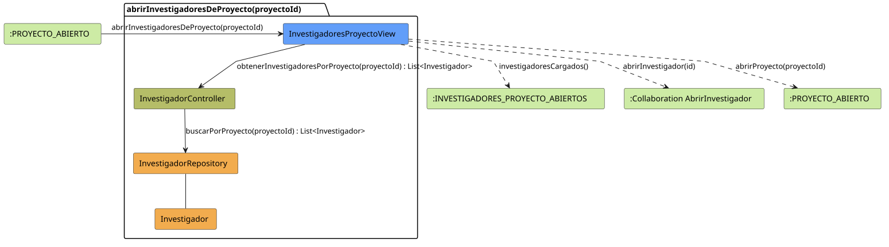

# FUNIBER GIPF > abrirInvestigadoresDeProyecto > Análisis

## información del artefacto

- **Proyecto**: FUNIBER GIPF - Plataforma Interna de Investigación
- **Fase**: Análisis
- **Disciplina**: Análisis y Diseño
- **Versión**: 1.0
- **Fecha**: 2026-05-25
- **Autor**: Diego Martínez

## propósito

Análisis de colaboración del caso de uso `abrirInvestigadoresDeProyecto(proyectoId)` mediante el patrón MVC. Este caso de uso surge del split de `abrirInvestigadores()`: cuando se invoca desde el detalle de un proyecto concreto, el sistema debe listar únicamente los investigadores asignados a ese proyecto, no todos los investigadores de la plataforma.

## diagrama de colaboración

||
|-|
|Código fuente: [abrirInvestigadoresDeProyecto.puml](../../../modelosUML/analisis/coordinador/abrirInvestigadoresDeProyecto.puml)|

## clases de análisis identificadas

### clases de vista (boundary)

#### InvestigadoresProyectoView
**Estereotipo**: Vista (Boundary)  
**Responsabilidades**:
- Presentar la lista de investigadores del proyecto concreto al Coordinador
- Ofrecer acceso al perfil de un investigador concreto
- Navegar de vuelta al proyecto

**Colaboraciones**:
- **Entrada**: Recibe `abrirInvestigadoresDeProyecto(proyectoId)` desde `:PROYECTO_ABIERTO`
- **Control**: Se comunica con `InvestigadorController`
- **Salida**: Navega a `:INVESTIGADORES_PROYECTO_ABIERTOS` y colaboración `AbrirInvestigador`

### clases de control

#### InvestigadorController
**Estereotipo**: Control  
**Responsabilidades**:
- Coordinar la obtención de los investigadores filtrados por proyecto
- Servir como intermediario entre la vista y el repositorio

**Colaboraciones**:
- **Vista**: Responde a solicitudes de `InvestigadoresProyectoView`
- **Repositorio**: Delega el acceso a datos a `InvestigadorRepository`

### clases de entidad (entity)

#### InvestigadorRepository
**Estereotipo**: Entidad  
**Responsabilidades**:
- Abstraer el acceso a datos de investigadores
- Proporcionar método para obtener investigadores filtrados por proyecto

**Colaboraciones**:
- **Control**: Responde a `InvestigadorController`
- **Entidad**: Gestiona instancias de `Investigador`

#### Investigador
**Estereotipo**: Entidad  
**Responsabilidades**:
- Representar la información de un investigador
- Encapsular atributos: nombre, apellidos, área, institución, proyectos asociados

**Colaboraciones**:
- **Repositorio**: Es gestionado por `InvestigadorRepository`

## flujo de colaboración

### secuencia de operaciones

1. **Inicio**: `:PROYECTO_ABIERTO` → `InvestigadoresProyectoView.abrirInvestigadoresDeProyecto(proyectoId)`
2. **Listado filtrado**: `InvestigadoresProyectoView` → `InvestigadorController.obtenerInvestigadoresPorProyecto(proyectoId)` : `List<Investigador>`
3. **Acceso a datos**: `InvestigadorController` → `InvestigadorRepository.buscarPorProyecto(proyectoId)` : `List<Investigador>`
4. **Presentación**: `InvestigadoresProyectoView` → `:INVESTIGADORES_PROYECTO_ABIERTOS.investigadoresCargados()`

## correspondencia con requisitos

|Requisito del caso de uso|Clase responsable|Método/Colaboración|
|-|-|-|
|Listar investigadores del proyecto|`InvestigadoresProyectoView`|Coordina con `InvestigadorController.obtenerInvestigadoresPorProyecto(proyectoId)`|
|Abrir perfil de investigador|`InvestigadoresProyectoView`|→ Colaboración `AbrirInvestigador`|
|Volver al proyecto|`InvestigadoresProyectoView`|→ `:PROYECTO_ABIERTO`|

## características del análisis

### separación de responsabilidades MVC

- **Vista**: Solo presentación e interacción con el Coordinador
- **Control**: Solo coordinación y filtrado de investigadores por proyecto
- **Entidad**: Solo datos y reglas de negocio del investigador

### distinción respecto a `abrirInvestigadores()`

Este caso de uso difiere de `abrirInvestigadores()` en el scope de los datos:
- `abrirInvestigadores()` → lista todos los investigadores de la plataforma (desde el panel principal)
- `abrirInvestigadoresDeProyecto(proyectoId)` → lista solo los investigadores del proyecto indicado (desde su detalle)

## patrones aplicados

### repository pattern
`InvestigadorRepository` abstrae el acceso a datos, permitiendo diferentes implementaciones sin afectar al controlador.

### mvc pattern
Separación clara entre presentación (`InvestigadoresProyectoView`), lógica de aplicación (`InvestigadorController`) y datos (`Investigador`, `InvestigadorRepository`).

## referencias

- [Análisis: abrirInvestigadores()](abrirInvestigadores.md)
- [Modelo del dominio](../../../context/modeloDelDominio/modeloDominio.md)
