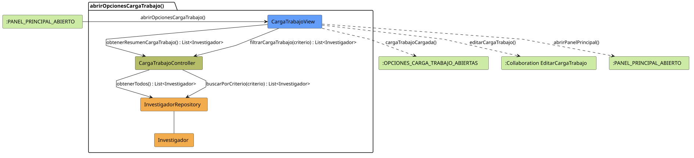

# FUNIBER GIPF > abrirOpcionesCargaTrabajo > Análisis

## información del artefacto

- **Proyecto**: FUNIBER GIPF - Plataforma Interna de Investigación
- **Fase**: Análisis
- **Disciplina**: Análisis y Diseño
- **Versión**: 1.0
- **Fecha**: 2026-05-23
- **Autor**: Diego Martínez

## propósito

Análisis de colaboración del caso de uso `abrirOpcionesCargaTrabajo()` mediante el patrón MVC, identificando las clases de análisis, sus responsabilidades y colaboraciones necesarias para presentar el resumen de carga de trabajo de los investigadores al Coordinador.

## diagrama de colaboración

||
|-|
|Código fuente: [abrirOpcionesCargaTrabajo.puml](../../../modelosUML/analisis/coordinador/abrirOpcionesCargaTrabajo.puml)|

## clases de análisis identificadas

### clases de vista (boundary)

#### CargaTrabajoView
**Estereotipo**: Vista (Boundary)  
**Responsabilidades**:
- Presentar el resumen de carga de trabajo de todos los investigadores
- Permitir filtrar por criterios de búsqueda
- Ofrecer acceso a la edición de la carga de trabajo de un investigador concreto
- Navegar de vuelta al panel principal

**Colaboraciones**:
- **Entrada**: Recibe `abrirOpcionesCargaTrabajo()` desde `:PANEL_PRINCIPAL_ABIERTO`
- **Control**: Se comunica con `CargaTrabajoController`
- **Salida**: Navega a `:OPCIONES_CARGA_TRABAJO_ABIERTAS`, a colaboración `EditarCargaTrabajo` o de vuelta al panel

### clases de control

#### CargaTrabajoController
**Estereotipo**: Control  
**Responsabilidades**:
- Coordinar la obtención del resumen de carga de trabajo de todos los investigadores
- Manejar la lógica de filtrado por criterios
- Servir como intermediario entre la vista y el repositorio

**Colaboraciones**:
- **Vista**: Responde a solicitudes de `CargaTrabajoView`
- **Repositorio**: Delega el acceso a datos a `InvestigadorRepository`

### clases de entidad (entity)

#### InvestigadorRepository
**Estereotipo**: Entidad  
**Responsabilidades**:
- Abstraer el acceso a datos de investigadores
- Proporcionar método para obtener todos los investigadores
- Implementar búsqueda por criterios de filtrado

**Colaboraciones**:
- **Control**: Responde a `CargaTrabajoController`
- **Entidad**: Gestiona instancias de `Investigador`

#### Investigador
**Estereotipo**: Entidad  
**Responsabilidades**:
- Representar la información de un investigador incluyendo su carga de trabajo
- Encapsular atributos: nombre, área, proyectos activos, dedicación

**Colaboraciones**:
- **Repositorio**: Es gestionado por `InvestigadorRepository`

## flujo de colaboración

### secuencia de operaciones

1. **Inicio**: `:PANEL_PRINCIPAL_ABIERTO` → `CargaTrabajoView.abrirOpcionesCargaTrabajo()`
2. **Obtención de datos**: `CargaTrabajoView` → `CargaTrabajoController.obtenerResumenCargaTrabajo()` : `List<Investigador>`
3. **Acceso a datos**: `CargaTrabajoController` → `InvestigadorRepository.obtenerTodos()` : `List<Investigador>`
4. **Filtrado (opcional)**: `CargaTrabajoView` → `CargaTrabajoController.filtrarCargaTrabajo(criterio)` : `List<Investigador>`
5. **Búsqueda**: `CargaTrabajoController` → `InvestigadorRepository.buscarPorCriterio(criterio)` : `List<Investigador>`
6. **Presentación**: `CargaTrabajoView` → `:OPCIONES_CARGA_TRABAJO_ABIERTAS.cargaTrabajoCargada()`

## correspondencia con requisitos

|Requisito del caso de uso|Clase responsable|Método/Colaboración|
|-|-|-|
|Presentar resumen de carga de trabajo|`CargaTrabajoView`|Coordina con `CargaTrabajoController.obtenerResumenCargaTrabajo()`|
|Filtrar por criterio|`CargaTrabajoView`|Invoca `CargaTrabajoController.filtrarCargaTrabajo(criterio)`|
|Acceder a edición de carga|`CargaTrabajoView`|→ Colaboración `EditarCargaTrabajo`|
|Datos de los investigadores|`Investigador`|Encapsula atributos de carga de trabajo|

## características del análisis

### separación de responsabilidades MVC

- **Vista**: Solo presentación e interacción con el Coordinador
- **Control**: Solo coordinación y lógica de filtrado
- **Entidad**: Solo datos y reglas de negocio del investigador

### agnóstico tecnológicamente

- No especifica tecnología de interfaz de usuario
- No asume implementación específica de base de datos
- Mantiene independencia de frameworks

### trazabilidad completa

- **Origen**: Caso de uso detallado `abrirOpcionesCargaTrabajo()`
- **Destino**: Base para diseño arquitectónico
- **Conexión**: Diagrama de estados → Análisis de colaboración

## patrones aplicados

### repository pattern
`InvestigadorRepository` abstrae el acceso a datos, permitiendo diferentes implementaciones sin afectar al controlador.

### mvc pattern
Separación clara entre presentación (`CargaTrabajoView`), lógica de aplicación (`CargaTrabajoController`) y datos (`Investigador`, `InvestigadorRepository`).

## referencias

- [Especificación detallada: abrirOpcionesCargaTrabajo()](../../../context/casosDeUso/detalle/coordinador/abrirOpcionesCargaTrabajo/abrirOpcionesCargaTrabajo.md)
- [Modelo del dominio](../../../context/modeloDelDominio/modeloDominio.md)
