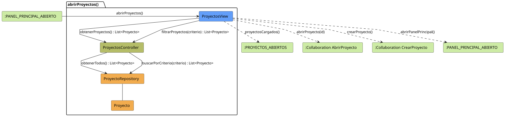

# FUNIBER GIPF > abrirProyectos > Análisis

## información del artefacto

- **Proyecto**: FUNIBER GIPF - Plataforma Interna de Investigación
- **Fase**: Análisis
- **Disciplina**: Análisis y Diseño
- **Versión**: 1.0
- **Fecha**: 2026-05-23
- **Autor**: Diego Martínez

## propósito

Análisis de colaboración del caso de uso `abrirProyectos()` mediante el patrón MVC, identificando las clases de análisis, sus responsabilidades y colaboraciones necesarias para listar y filtrar los proyectos de investigación disponibles.

## diagrama de colaboración

||
|-|
|Código fuente: [abrirProyectos.puml](../../../modelosUML/analisis/coordinador/abrirProyectos.puml)|

## clases de análisis identificadas

### clases de vista (boundary)

#### ProyectosView
**Estereotipo**: Vista (Boundary)  
**Responsabilidades**:
- Presentar la lista de proyectos de investigación al Coordinador
- Permitir filtrar proyectos por criterios de búsqueda
- Ofrecer acceso a un proyecto concreto y a la creación de nuevos proyectos
- Navegar de vuelta al panel principal

**Colaboraciones**:
- **Entrada**: Recibe `abrirProyectos()` desde `:PANEL_PRINCIPAL_ABIERTO`
- **Control**: Se comunica con `ProyectosController`
- **Salida**: Navega a `:PROYECTOS_ABIERTOS`, colaboraciones `AbrirProyecto` y `CrearProyecto`

### clases de control

#### ProyectosController
**Estereotipo**: Control  
**Responsabilidades**:
- Coordinar la obtención de la lista completa de proyectos
- Gestionar la lógica de filtrado por criterios
- Servir como intermediario entre la vista y el repositorio

**Colaboraciones**:
- **Vista**: Responde a solicitudes de `ProyectosView`
- **Repositorio**: Delega el acceso a datos a `ProyectoRepository`

### clases de entidad (entity)

#### ProyectoRepository
**Estereotipo**: Entidad  
**Responsabilidades**:
- Abstraer el acceso a datos de proyectos
- Proporcionar método para obtener todos los proyectos
- Implementar búsqueda por criterios específicos

**Colaboraciones**:
- **Control**: Responde a `ProyectosController`
- **Entidad**: Gestiona instancias de `Proyecto`

#### Proyecto
**Estereotipo**: Entidad  
**Responsabilidades**:
- Representar la información de un proyecto de investigación
- Encapsular atributos: título, descripción, estado, fechas, investigadores participantes

**Colaboraciones**:
- **Repositorio**: Es gestionado por `ProyectoRepository`

## flujo de colaboración

### secuencia de operaciones

1. **Inicio**: `:PANEL_PRINCIPAL_ABIERTO` → `ProyectosView.abrirProyectos()`
2. **Listado**: `ProyectosView` → `ProyectosController.obtenerProyectos()` : `List<Proyecto>`
3. **Acceso a datos**: `ProyectosController` → `ProyectoRepository.obtenerTodos()` : `List<Proyecto>`
4. **Filtrado (opcional)**: `ProyectosView` → `ProyectosController.filtrarProyectos(criterio)` : `List<Proyecto>`
5. **Búsqueda**: `ProyectosController` → `ProyectoRepository.buscarPorCriterio(criterio)` : `List<Proyecto>`
6. **Presentación**: `ProyectosView` → `:PROYECTOS_ABIERTOS.proyectosCargados()`

## correspondencia con requisitos

|Requisito del caso de uso|Clase responsable|Método/Colaboración|
|-|-|-|
|Presentar lista de proyectos|`ProyectosView`|Coordina con `ProyectosController.obtenerProyectos()`|
|Permitir filtrado|`ProyectosView`|Invoca `ProyectosController.filtrarProyectos(criterio)`|
|Abrir proyecto concreto|`ProyectosView`|→ Colaboración `AbrirProyecto`|
|Crear nuevo proyecto|`ProyectosView`|→ Colaboración `CrearProyecto`|

## características del análisis

### separación de responsabilidades MVC

- **Vista**: Solo presentación e interacción con el Coordinador
- **Control**: Solo coordinación y lógica de filtrado
- **Entidad**: Solo datos y reglas de negocio del proyecto

### agnóstico tecnológicamente

- No especifica tecnología de interfaz de usuario
- No asume implementación específica de base de datos
- Mantiene independencia de frameworks

### trazabilidad completa

- **Origen**: Caso de uso detallado `abrirProyectos()`
- **Destino**: Base para diseño arquitectónico
- **Conexión**: Diagrama de estados → Análisis de colaboración

## patrones aplicados

### repository pattern
`ProyectoRepository` abstrae el acceso a datos, permitiendo diferentes implementaciones sin afectar al controlador.

### mvc pattern
Separación clara entre presentación (`ProyectosView`), lógica de aplicación (`ProyectosController`) y datos (`Proyecto`, `ProyectoRepository`).

## referencias

- [Especificación detallada: abrirProyectos()](../../../context/casosDeUso/detalle/coordinador/abrirProyectos/abrirProyectos.md)
- [Modelo del dominio](../../../context/modeloDelDominio/modeloDominio.md)
