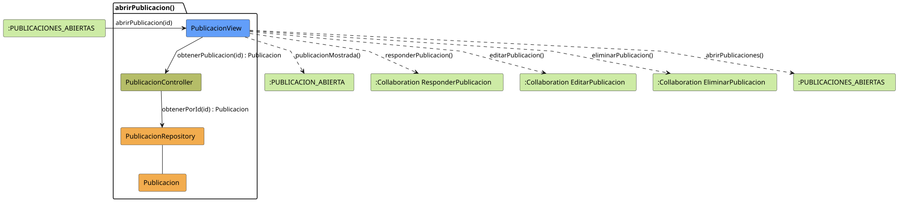

# FUNIBER GIPF > abrirPublicacion > Análisis

## información del artefacto

- **Proyecto**: FUNIBER GIPF - Plataforma Interna de Investigación
- **Fase**: Análisis
- **Disciplina**: Análisis y Diseño
- **Versión**: 1.0
- **Fecha**: 2026-05-23
- **Autor**: Diego Martínez

## propósito

Análisis de colaboración del caso de uso `abrirPublicacion()` mediante el patrón MVC, identificando las clases de análisis, sus responsabilidades y colaboraciones necesarias para presentar el detalle de una publicación al Coordinador.

## diagrama de colaboración

||
|-|
|Código fuente: [abrirPublicacion.puml](../../../modelosUML/analisis/coordinador/abrirPublicacion.puml)|

## clases de análisis identificadas

### clases de vista (boundary)

#### PublicacionView
**Estereotipo**: Vista (Boundary)  
**Responsabilidades**:
- Presentar el detalle completo de la publicación al Coordinador
- Ofrecer opciones de respuesta, edición y eliminación
- Navegar de vuelta a la lista de publicaciones

**Colaboraciones**:
- **Entrada**: Recibe `abrirPublicacion(id)` desde `:PUBLICACIONES_ABIERTAS`
- **Control**: Se comunica con `PublicacionController`
- **Salida**: Navega a `:PUBLICACION_ABIERTA` y a colaboraciones de gestión

### clases de control

#### PublicacionController
**Estereotipo**: Control  
**Responsabilidades**:
- Coordinar la obtención del detalle de la publicación
- Servir como intermediario entre la vista y el repositorio

**Colaboraciones**:
- **Vista**: Responde a solicitudes de `PublicacionView`
- **Repositorio**: Delega el acceso a datos a `PublicacionRepository`

### clases de entidad (entity)

#### PublicacionRepository
**Estereotipo**: Entidad  
**Responsabilidades**:
- Abstraer el acceso a datos de publicaciones
- Proporcionar método para obtener una publicación por identificador

**Colaboraciones**:
- **Control**: Responde a `PublicacionController`
- **Entidad**: Gestiona instancias de `Publicacion`

#### Publicacion
**Estereotipo**: Entidad  
**Responsabilidades**:
- Representar la información completa de una publicación
- Encapsular atributos: título, resumen, contenido, autores, fecha, área temática, respuestas

**Colaboraciones**:
- **Repositorio**: Es gestionado por `PublicacionRepository`

## flujo de colaboración

### secuencia de operaciones

1. **Inicio**: `:PUBLICACIONES_ABIERTAS` → `PublicacionView.abrirPublicacion(id)`
2. **Obtención**: `PublicacionView` → `PublicacionController.obtenerPublicacion(id)` : `Publicacion`
3. **Acceso a datos**: `PublicacionController` → `PublicacionRepository.obtenerPorId(id)` : `Publicacion`
4. **Presentación**: `PublicacionView` → `:PUBLICACION_ABIERTA.publicacionMostrada()`

## correspondencia con requisitos

|Requisito del caso de uso|Clase responsable|Método/Colaboración|
|-|-|-|
|Mostrar detalle de la publicación|`PublicacionView`|Coordina con `PublicacionController.obtenerPublicacion(id)`|
|Datos de la publicación|`Publicacion`|Encapsula todos los atributos|
|Responder publicación|`PublicacionView`|→ Colaboración `ResponderPublicacion`|
|Editar publicación|`PublicacionView`|→ Colaboración `EditarPublicacion`|
|Eliminar publicación|`PublicacionView`|→ Colaboración `EliminarPublicacion`|

## características del análisis

### separación de responsabilidades MVC

- **Vista**: Solo presentación e interacción con el Coordinador
- **Control**: Solo coordinación y obtención del detalle
- **Entidad**: Solo datos y reglas de negocio de la publicación

### agnóstico tecnológicamente

- No especifica tecnología de interfaz de usuario
- No asume implementación específica de base de datos
- Mantiene independencia de frameworks

### trazabilidad completa

- **Origen**: Caso de uso detallado `abrirPublicacion()`
- **Destino**: Base para diseño arquitectónico
- **Conexión**: Diagrama de estados → Análisis de colaboración

## patrones aplicados

### repository pattern
`PublicacionRepository` abstrae el acceso a datos, permitiendo diferentes implementaciones sin afectar al controlador.

### mvc pattern
Separación clara entre presentación (`PublicacionView`), lógica de aplicación (`PublicacionController`) y datos (`Publicacion`, `PublicacionRepository`).

## referencias

- [Especificación detallada: abrirPublicacion()](../../../context/casosDeUso/detalle/coordinador/abrirPublicacion/abrirPublicacion.md)
- [Modelo del dominio](../../../context/modeloDelDominio/modeloDominio.md)
