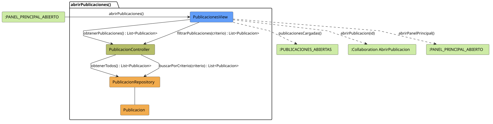

# FUNIBER GIPF > abrirPublicaciones > Análisis

## información del artefacto

- **Proyecto**: FUNIBER GIPF - Plataforma Interna de Investigación
- **Fase**: Análisis
- **Disciplina**: Análisis y Diseño
- **Versión**: 1.0
- **Fecha**: 2026-05-23
- **Autor**: Diego Martínez

## propósito

Análisis de colaboración del caso de uso `abrirPublicaciones()` mediante el patrón MVC, identificando las clases de análisis, sus responsabilidades y colaboraciones necesarias para listar y filtrar todas las publicaciones disponibles en el sistema.

## diagrama de colaboración

||
|-|
|Código fuente: [abrirPublicaciones.puml](../../../modelosUML/analisis/coordinador/abrirPublicaciones.puml)|

## clases de análisis identificadas

### clases de vista (boundary)

#### PublicacionesView
**Estereotipo**: Vista (Boundary)  
**Responsabilidades**:
- Presentar la lista de publicaciones disponibles al Coordinador
- Permitir filtrar publicaciones por criterios de búsqueda
- Ofrecer acceso a una publicación concreta
- Navegar de vuelta al panel principal

**Colaboraciones**:
- **Entrada**: Recibe `abrirPublicaciones()` desde `:PANEL_PRINCIPAL_ABIERTO`
- **Control**: Se comunica con `PublicacionController`
- **Salida**: Navega a `:PUBLICACIONES_ABIERTAS` y colaboración `AbrirPublicacion`

### clases de control

#### PublicacionController
**Estereotipo**: Control  
**Responsabilidades**:
- Coordinar la obtención de todas las publicaciones
- Gestionar la lógica de filtrado por criterios
- Servir como intermediario entre la vista y el repositorio

**Colaboraciones**:
- **Vista**: Responde a solicitudes de `PublicacionesView`
- **Repositorio**: Delega el acceso a datos a `PublicacionRepository`

### clases de entidad (entity)

#### PublicacionRepository
**Estereotipo**: Entidad  
**Responsabilidades**:
- Abstraer el acceso a datos de publicaciones
- Proporcionar método para obtener todas las publicaciones
- Implementar búsqueda por criterios específicos

**Colaboraciones**:
- **Control**: Responde a `PublicacionController`
- **Entidad**: Gestiona instancias de `Publicacion`

#### Publicacion
**Estereotipo**: Entidad  
**Responsabilidades**:
- Representar la información de una publicación
- Encapsular atributos: título, resumen, autores, fecha, área temática

**Colaboraciones**:
- **Repositorio**: Es gestionado por `PublicacionRepository`

## flujo de colaboración

### secuencia de operaciones

1. **Inicio**: `:PANEL_PRINCIPAL_ABIERTO` → `PublicacionesView.abrirPublicaciones()`
2. **Listado**: `PublicacionesView` → `PublicacionController.obtenerPublicaciones()` : `List<Publicacion>`
3. **Acceso a datos**: `PublicacionController` → `PublicacionRepository.obtenerTodos()` : `List<Publicacion>`
4. **Filtrado (opcional)**: `PublicacionesView` → `PublicacionController.filtrarPublicaciones(criterio)` : `List<Publicacion>`
5. **Presentación**: `PublicacionesView` → `:PUBLICACIONES_ABIERTAS.publicacionesCargadas()`

## correspondencia con requisitos

|Requisito del caso de uso|Clase responsable|Método/Colaboración|
|-|-|-|
|Presentar lista de publicaciones|`PublicacionesView`|Coordina con `PublicacionController.obtenerPublicaciones()`|
|Permitir filtrado|`PublicacionesView`|Invoca `PublicacionController.filtrarPublicaciones(criterio)`|
|Abrir publicación concreta|`PublicacionesView`|→ Colaboración `AbrirPublicacion`|

## características del análisis

### separación de responsabilidades MVC

- **Vista**: Solo presentación e interacción con el Coordinador
- **Control**: Solo coordinación y lógica de filtrado
- **Entidad**: Solo datos y reglas de negocio de la publicación

### agnóstico tecnológicamente

- No especifica tecnología de interfaz de usuario
- No asume implementación específica de base de datos
- Mantiene independencia de frameworks

### trazabilidad completa

- **Origen**: Caso de uso detallado `abrirPublicaciones()`
- **Destino**: Base para diseño arquitectónico
- **Conexión**: Diagrama de estados → Análisis de colaboración

## patrones aplicados

### repository pattern
`PublicacionRepository` abstrae el acceso a datos, permitiendo diferentes implementaciones sin afectar al controlador.

### mvc pattern
Separación clara entre presentación (`PublicacionesView`), lógica de aplicación (`PublicacionController`) y datos (`Publicacion`, `PublicacionRepository`).

## referencias

- [Especificación detallada: abrirPublicaciones()](../../../context/casosDeUso/detalle/coordinador/abrirPublicaciones/abrirPublicaciones.md)
- [Modelo del dominio](../../../context/modeloDelDominio/modeloDominio.md)
