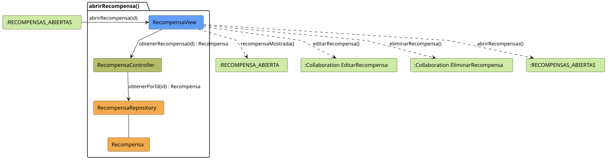

# FUNIBER GIPF > abrirRecompensa > Análisis

## información del artefacto

- **Proyecto**: FUNIBER GIPF - Plataforma Interna de Investigación
- **Fase**: Análisis
- **Disciplina**: Análisis y Diseño
- **Versión**: 1.0
- **Fecha**: 2026-05-23
- **Autor**: Diego Martínez

## propósito

Análisis de colaboración del caso de uso `abrirRecompensa()` mediante el patrón MVC, identificando las clases de análisis, sus responsabilidades y colaboraciones necesarias para presentar el detalle de una recompensa al Coordinador.

## diagrama de colaboración

||
|-|
|Código fuente: [abrirRecompensa.puml](../../../modelosUML/analisis/coordinador/abrirRecompensa.puml)|

## clases de análisis identificadas

### clases de vista (boundary)

#### RecompensaView
**Estereotipo**: Vista (Boundary)  
**Responsabilidades**:
- Presentar el detalle completo de la recompensa al Coordinador
- Ofrecer opciones de edición y eliminación
- Navegar de vuelta a la lista de recompensas

**Colaboraciones**:
- **Entrada**: Recibe `abrirRecompensa(id)` desde `:RECOMPENSAS_ABIERTAS`
- **Control**: Se comunica con `RecompensaController`
- **Salida**: Navega a `:RECOMPENSA_ABIERTA` y a colaboraciones de gestión

### clases de control

#### RecompensaController
**Estereotipo**: Control  
**Responsabilidades**:
- Coordinar la obtención del detalle de la recompensa
- Servir como intermediario entre la vista y el repositorio

**Colaboraciones**:
- **Vista**: Responde a solicitudes de `RecompensaView`
- **Repositorio**: Delega el acceso a datos a `RecompensaRepository`

### clases de entidad (entity)

#### RecompensaRepository
**Estereotipo**: Entidad  
**Responsabilidades**:
- Abstraer el acceso a datos de recompensas
- Proporcionar método para obtener una recompensa por identificador

**Colaboraciones**:
- **Control**: Responde a `RecompensaController`
- **Entidad**: Gestiona instancias de `Recompensa`

#### Recompensa
**Estereotipo**: Entidad  
**Responsabilidades**:
- Representar la información completa de una recompensa
- Encapsular atributos: título, descripción, tipo, valor, condiciones, beneficiarios

**Colaboraciones**:
- **Repositorio**: Es gestionado por `RecompensaRepository`

## flujo de colaboración

### secuencia de operaciones

1. **Inicio**: `:RECOMPENSAS_ABIERTAS` → `RecompensaView.abrirRecompensa(id)`
2. **Obtención**: `RecompensaView` → `RecompensaController.obtenerRecompensa(id)` : `Recompensa`
3. **Acceso a datos**: `RecompensaController` → `RecompensaRepository.obtenerPorId(id)` : `Recompensa`
4. **Presentación**: `RecompensaView` → `:RECOMPENSA_ABIERTA.recompensaMostrada()`

## correspondencia con requisitos

|Requisito del caso de uso|Clase responsable|Método/Colaboración|
|-|-|-|
|Mostrar detalle de la recompensa|`RecompensaView`|Coordina con `RecompensaController.obtenerRecompensa(id)`|
|Datos de la recompensa|`Recompensa`|Encapsula todos los atributos|
|Editar recompensa|`RecompensaView`|→ Colaboración `EditarRecompensa`|
|Eliminar recompensa|`RecompensaView`|→ Colaboración `EliminarRecompensa`|

## características del análisis

### separación de responsabilidades MVC

- **Vista**: Solo presentación e interacción con el Coordinador
- **Control**: Solo coordinación y obtención del detalle
- **Entidad**: Solo datos y reglas de negocio de la recompensa

### agnóstico tecnológicamente

- No especifica tecnología de interfaz de usuario
- No asume implementación específica de base de datos
- Mantiene independencia de frameworks

### trazabilidad completa

- **Origen**: Caso de uso detallado `abrirRecompensa()`
- **Destino**: Base para diseño arquitectónico
- **Conexión**: Diagrama de estados → Análisis de colaboración

## patrones aplicados

### repository pattern
`RecompensaRepository` abstrae el acceso a datos, permitiendo diferentes implementaciones sin afectar al controlador.

### mvc pattern
Separación clara entre presentación (`RecompensaView`), lógica de aplicación (`RecompensaController`) y datos (`Recompensa`, `RecompensaRepository`).

## referencias

- [Especificación detallada: abrirRecompensa()](../../../context/casosDeUso/detalle/coordinador/abrirRecompensa/abrirRecompensa.md)
- [Modelo del dominio](../../../context/modeloDelDominio/modeloDominio.md)
