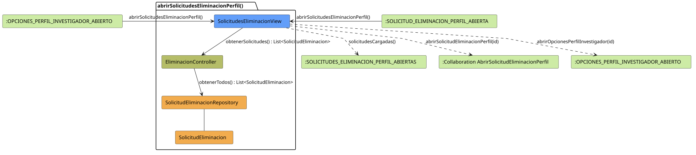

# FUNIBER GIPF > abrirSolicitudesEliminacionPerfil > Análisis

## información del artefacto

- **Proyecto**: FUNIBER GIPF - Plataforma Interna de Investigación
- **Fase**: Análisis
- **Disciplina**: Análisis y Diseño
- **Versión**: 1.0
- **Fecha**: 2026-05-23
- **Autor**: Diego Martínez

## propósito

Análisis de colaboración del caso de uso `abrirSolicitudesEliminacionPerfil()` mediante el patrón MVC, identificando las clases de análisis, sus responsabilidades y colaboraciones necesarias para listar las solicitudes de eliminación de perfil pendientes.

## diagrama de colaboración

||
|-|
|Código fuente: [abrirSolicitudesEliminacionPerfil.puml](../../../modelosUML/analisis/coordinador/abrirSolicitudesEliminacionPerfil.puml)|

## clases de análisis identificadas

### clases de vista (boundary)

#### SolicitudesEliminacionView
**Estereotipo**: Vista (Boundary)  
**Responsabilidades**:
- Presentar la lista de solicitudes de eliminación de perfil al Coordinador
- Ofrecer acceso a una solicitud concreta
- Navegar de vuelta al panel principal

**Colaboraciones**:
- **Entrada**: Recibe `abrirSolicitudesEliminacionPerfil()` desde `:PANEL_PRINCIPAL_ABIERTO`
- **Control**: Se comunica con `EliminacionController`
- **Salida**: Navega a `:SOLICITUDES_ELIMINACION_PERFIL_ABIERTAS` y colaboración `AbrirSolicitudEliminacionPerfil`

### clases de control

#### EliminacionController
**Estereotipo**: Control  
**Responsabilidades**:
- Coordinar la obtención de todas las solicitudes de eliminación
- Servir como intermediario entre la vista y el repositorio

**Colaboraciones**:
- **Vista**: Responde a solicitudes de `SolicitudesEliminacionView`
- **Repositorio**: Delega el acceso a datos a `SolicitudEliminacionRepository`

### clases de entidad (entity)

#### SolicitudEliminacionRepository
**Estereotipo**: Entidad  
**Responsabilidades**:
- Abstraer el acceso a datos de solicitudes de eliminación
- Proporcionar método para obtener todas las solicitudes

**Colaboraciones**:
- **Control**: Responde a `EliminacionController`
- **Entidad**: Gestiona instancias de `SolicitudEliminacion`

#### SolicitudEliminacion
**Estereotipo**: Entidad  
**Responsabilidades**:
- Representar la información de una solicitud de eliminación de perfil
- Encapsular atributos: investigador, motivo, fecha, estado

**Colaboraciones**:
- **Repositorio**: Es gestionado por `SolicitudEliminacionRepository`

## flujo de colaboración

### secuencia de operaciones

1. **Inicio**: `:PANEL_PRINCIPAL_ABIERTO` → `SolicitudesEliminacionView.abrirSolicitudesEliminacionPerfil()`
2. **Listado**: `SolicitudesEliminacionView` → `EliminacionController.obtenerSolicitudes()` : `List<SolicitudEliminacion>`
3. **Acceso a datos**: `EliminacionController` → `SolicitudEliminacionRepository.obtenerTodos()` : `List<SolicitudEliminacion>`
4. **Presentación**: `SolicitudesEliminacionView` → `:SOLICITUDES_ELIMINACION_PERFIL_ABIERTAS.solicitudesCargadas()`

## correspondencia con requisitos

|Requisito del caso de uso|Clase responsable|Método/Colaboración|
|-|-|-|
|Listar solicitudes de eliminación|`SolicitudesEliminacionView`|Coordina con `EliminacionController.obtenerSolicitudes()`|
|Abrir solicitud concreta|`SolicitudesEliminacionView`|→ Colaboración `AbrirSolicitudEliminacionPerfil`|

## características del análisis

### separación de responsabilidades MVC

- **Vista**: Solo presentación e interacción con el Coordinador
- **Control**: Solo coordinación y acceso a datos
- **Entidad**: Solo datos y reglas de negocio de la solicitud

### agnóstico tecnológicamente

- No especifica tecnología de interfaz de usuario
- No asume implementación específica de base de datos
- Mantiene independencia de frameworks

### trazabilidad completa

- **Origen**: Caso de uso detallado `abrirSolicitudesEliminacionPerfil()`
- **Destino**: Base para diseño arquitectónico
- **Conexión**: Diagrama de estados → Análisis de colaboración

## patrones aplicados

### repository pattern
`SolicitudEliminacionRepository` abstrae el acceso a datos, permitiendo diferentes implementaciones sin afectar al controlador.

### mvc pattern
Separación clara entre presentación (`SolicitudesEliminacionView`), lógica de aplicación (`EliminacionController`) y datos (`SolicitudEliminacion`, `SolicitudEliminacionRepository`).

## referencias

- [Especificación detallada: abrirSolicitudesEliminacionPerfil()](../../../context/casosDeUso/detalle/coordinador/abrirSolicitudesEliminacionPerfil/abrirSolicitudesEliminacionPerfil.md)
- [Modelo del dominio](../../../context/modeloDelDominio/modeloDominio.md)
