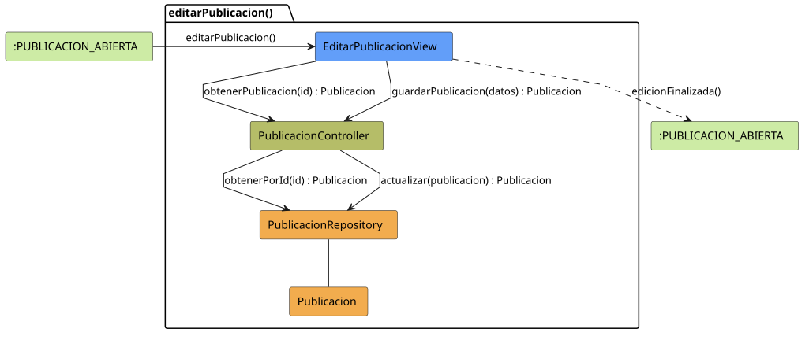

# FUNIBER GIPF > editarPublicacion > Análisis

## información del artefacto

- **Proyecto**: FUNIBER GIPF - Plataforma Interna de Investigación
- **Fase**: Análisis
- **Disciplina**: Análisis y Diseño
- **Versión**: 1.0
- **Fecha**: 2026-05-23
- **Autor**: Diego Martínez

## propósito

Análisis de colaboración del caso de uso `editarPublicacion()` mediante el patrón MVC, identificando las clases de análisis, sus responsabilidades y colaboraciones necesarias para modificar los datos de una publicación existente.

## diagrama de colaboración

||
|-|
|Código fuente: [editarPublicacion.puml](../../../modelosUML/analisis/coordinador/editarPublicacion.puml)|

## clases de análisis identificadas

### clases de vista (boundary)

#### EditarPublicacionView
**Estereotipo**: Vista (Boundary)  
**Responsabilidades**:
- Presentar el formulario de edición con los datos actuales de la publicación
- Recuperar los datos actuales a través del controlador
- Capturar los cambios del Coordinador
- Invocar el guardado en el controlador
- Navegar de vuelta a la publicación tras la edición

**Colaboraciones**:
- **Entrada**: Recibe `editarPublicacion()` desde `:PUBLICACION_ABIERTA`
- **Control**: Se comunica con `PublicacionController`
- **Salida**: Navega a `:PUBLICACION_ABIERTA`

### clases de control

#### PublicacionController
**Estereotipo**: Control  
**Responsabilidades**:
- Coordinar la obtención y persistencia de los datos de la publicación
- Servir como intermediario entre la vista y el repositorio

**Colaboraciones**:
- **Vista**: Responde a solicitudes de `EditarPublicacionView`
- **Repositorio**: Delega operaciones a `PublicacionRepository`

### clases de entidad (entity)

#### PublicacionRepository
**Estereotipo**: Entidad  
**Responsabilidades**:
- Abstraer el acceso a datos de publicaciones
- Proporcionar métodos para obtener y actualizar una publicación

**Colaboraciones**:
- **Control**: Responde a `PublicacionController`
- **Entidad**: Gestiona instancias de `Publicacion`

#### Publicacion
**Estereotipo**: Entidad  
**Responsabilidades**:
- Representar la información completa de una publicación
- Encapsular atributos editables: título, resumen, contenido, área temática

**Colaboraciones**:
- **Repositorio**: Es gestionado por `PublicacionRepository`

## flujo de colaboración

### secuencia de operaciones

1. **Inicio**: `:PUBLICACION_ABIERTA` → `EditarPublicacionView.editarPublicacion()`
2. **Carga**: `EditarPublicacionView` → `PublicacionController.obtenerPublicacion(id)` : `Publicacion`
3. **Acceso a datos**: `PublicacionController` → `PublicacionRepository.obtenerPorId(id)` : `Publicacion`
4. **Edición**: El Coordinador modifica los datos
5. **Guardado**: `EditarPublicacionView` → `PublicacionController.guardarPublicacion(datos)` : `Publicacion`
6. **Persistencia**: `PublicacionController` → `PublicacionRepository.actualizar(publicacion)` : `Publicacion`
7. **Finalización**: `EditarPublicacionView` → `:PUBLICACION_ABIERTA.edicionFinalizada()`

## correspondencia con requisitos

|Requisito del caso de uso|Clase responsable|Método/Colaboración|
|-|-|-|
|Mostrar datos actuales|`EditarPublicacionView`|Coordina con `PublicacionController.obtenerPublicacion(id)`|
|Modificar publicación|`EditarPublicacionView`|Captura cambios en el formulario|
|Persistir cambios|`PublicacionController`|`guardarPublicacion(datos)` → `PublicacionRepository.actualizar()`|

## características del análisis

### separación de responsabilidades MVC

- **Vista**: Solo presentación del formulario e interacción con el Coordinador
- **Control**: Solo coordinación de la obtención y persistencia
- **Entidad**: Solo datos y reglas de negocio de la publicación

### agnóstico tecnológicamente

- No especifica tecnología de interfaz de usuario
- No asume implementación específica de base de datos
- Mantiene independencia de frameworks

### trazabilidad completa

- **Origen**: Caso de uso detallado `editarPublicacion()`
- **Destino**: Base para diseño arquitectónico
- **Conexión**: Diagrama de estados → Análisis de colaboración

## patrones aplicados

### repository pattern
`PublicacionRepository` abstrae el acceso a datos, permitiendo diferentes implementaciones sin afectar al controlador.

### mvc pattern
Separación clara entre presentación (`EditarPublicacionView`), lógica de aplicación (`PublicacionController`) y datos (`Publicacion`, `PublicacionRepository`).

## referencias

- [Especificación detallada: editarPublicacion()](../../../context/casosDeUso/detalle/coordinador/editarPublicacion/editarPublicacion.md)
- [Modelo del dominio](../../../context/modeloDelDominio/modeloDominio.md)
