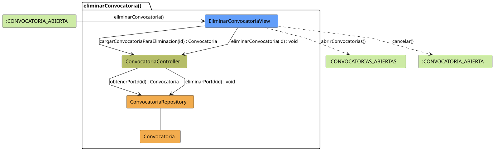

# FUNIBER GIPF > eliminarConvocatoria > Análisis

## información del artefacto

- **Proyecto**: FUNIBER GIPF - Plataforma Interna de Investigación
- **Fase**: Análisis
- **Disciplina**: Análisis y Diseño
- **Versión**: 1.0
- **Fecha**: 2026-06-11
- **Autor**: Diego Martínez

## propósito

Análisis de colaboración del caso de uso `eliminarConvocatoria()` mediante el patrón MVC, identificando las clases de análisis, sus responsabilidades y colaboraciones necesarias para eliminar una convocatoria del sistema.

## diagrama de colaboración

||
|-|
|Código fuente: [eliminarConvocatoria.puml](../../../modelosUML/analisis/coordinador/eliminarConvocatoria.puml)|

## clases de análisis identificadas

### clases de vista (boundary)

#### EliminarConvocatoriaView
**Estereotipo**: Vista (Boundary)  
**Responsabilidades**:
- Mostrar los datos de la convocatoria como pantalla de confirmación antes de eliminar
- Invocar la eliminación en el controlador tras confirmación del Coordinador
- Navegar al listado de convocatorias tras la operación

**Colaboraciones**:
- **Entrada**: Recibe `eliminarConvocatoria()` desde `:CONVOCATORIA_ABIERTA`
- **Control**: Se comunica con `ConvocatoriaController`
- **Salida**: Navega a `:CONVOCATORIAS_ABIERTAS` o cancela volviendo a `:CONVOCATORIA_ABIERTA`

### clases de control

#### ConvocatoriaController
**Estereotipo**: Control  
**Responsabilidades**:
- Cargar la convocatoria a eliminar para mostrarla en la confirmación
- Coordinar el proceso de eliminación definitiva

**Colaboraciones**:
- **Vista**: Responde a solicitudes de `EliminarConvocatoriaView`
- **Repositorio**: Delega la eliminación a `ConvocatoriaRepository`

### clases de entidad (entity)

#### ConvocatoriaRepository
**Estereotipo**: Entidad  
**Responsabilidades**:
- Abstraer el acceso a datos de convocatorias
- Proporcionar método para obtener una convocatoria por identificador
- Proporcionar método para eliminar una convocatoria por identificador

**Colaboraciones**:
- **Control**: Responde a `ConvocatoriaController`
- **Entidad**: Gestiona instancias de `Convocatoria`

#### Convocatoria
**Estereotipo**: Entidad  
**Responsabilidades**:
- Representar la convocatoria a eliminar
- Encapsular la información mostrada en la pantalla de confirmación

**Colaboraciones**:
- **Repositorio**: Es gestionado por `ConvocatoriaRepository`

## flujo de colaboración

### secuencia de operaciones

1. **Inicio**: `:CONVOCATORIA_ABIERTA` → `EliminarConvocatoriaView.eliminarConvocatoria()`
2. **Carga para confirmación**: `EliminarConvocatoriaView` → `ConvocatoriaController.cargarConvocatoriaParaEliminacion(id)` : `Convocatoria`
3. **Acceso a datos**: `ConvocatoriaController` → `ConvocatoriaRepository.obtenerPorId(id)` : `Convocatoria`
4. **Confirmación**: El Coordinador confirma la eliminación
5. **Eliminación**: `EliminarConvocatoriaView` → `ConvocatoriaController.eliminarConvocatoria(id)` : `void`
6. **Persistencia**: `ConvocatoriaController` → `ConvocatoriaRepository.eliminarPorId(id)` : `void`
7. **Finalización**: `EliminarConvocatoriaView` → `:CONVOCATORIAS_ABIERTAS.abrirConvocatorias()`

### flujo alternativo: cancelación

Si el Coordinador cancela, `EliminarConvocatoriaView` navega de vuelta a `:CONVOCATORIA_ABIERTA` sin ningún cambio en los datos.

## correspondencia con requisitos

|Requisito del caso de uso|Clase responsable|Método/Colaboración|
|-|-|-|
|Mostrar confirmación con datos|`EliminarConvocatoriaView`|Coordina con `ConvocatoriaController.cargarConvocatoriaParaEliminacion(id)`|
|Eliminar convocatoria|`ConvocatoriaController`|`eliminarConvocatoria(id)` → `ConvocatoriaRepository.eliminarPorId()`|
|Volver al listado tras eliminar|`EliminarConvocatoriaView`|→ `:CONVOCATORIAS_ABIERTAS`|
|Cancelar sin cambios|`EliminarConvocatoriaView`|→ `:CONVOCATORIA_ABIERTA`|

## características del análisis

### separación de responsabilidades MVC

- **Vista**: Solo presentación de la confirmación e interacción con el Coordinador
- **Control**: Solo coordinación del proceso de eliminación
- **Entidad**: Solo datos y gestión de la persistencia

### agnóstico tecnológicamente

- No especifica tecnología de interfaz de usuario
- No asume implementación específica de base de datos
- Mantiene independencia de frameworks

### trazabilidad completa

- **Origen**: Caso de uso `eliminarConvocatoria()` (añadido sobre la priorización inicial)
- **Destino**: Base para diseño arquitectónico
- **Conexión**: Diagrama de estados → Análisis de colaboración

## patrones aplicados

### repository pattern
`ConvocatoriaRepository` abstrae el acceso a datos, compartido con `abrirConvocatorias`, `abrirConvocatoria` e `importarConvocatoria`.

### mvc pattern
Separación clara entre presentación (`EliminarConvocatoriaView`), lógica de aplicación (`ConvocatoriaController`) y datos (`Convocatoria`, `ConvocatoriaRepository`).

## referencias

- [Análisis relacionado: abrirConvocatoria()](abrirConvocatoria.md)
- [Modelo del dominio](../../../context/modeloDelDominio/modeloDominio.md)
