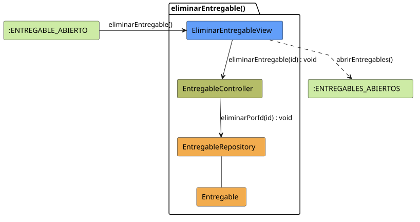

# FUNIBER GIPF > eliminarEntregable > Análisis

## información del artefacto

- **Proyecto**: FUNIBER GIPF - Plataforma Interna de Investigación
- **Fase**: Análisis
- **Disciplina**: Análisis y Diseño
- **Versión**: 1.0
- **Fecha**: 2026-05-23
- **Autor**: Diego Martínez

## propósito

Análisis de colaboración del caso de uso `eliminarEntregable()` mediante el patrón MVC, identificando las clases de análisis, sus responsabilidades y colaboraciones necesarias para eliminar un entregable de un proyecto.

## diagrama de colaboración

||
|-|
|Código fuente: [eliminarEntregable.puml](../../../modelosUML/analisis/coordinador/eliminarEntregable.puml)|

## clases de análisis identificadas

### clases de vista (boundary)

#### EliminarEntregableView
**Estereotipo**: Vista (Boundary)  
**Responsabilidades**:
- Mostrar confirmación de eliminación del entregable al Coordinador
- Invocar la eliminación en el controlador tras confirmación
- Navegar a la lista de entregables tras la operación

**Colaboraciones**:
- **Entrada**: Recibe `eliminarEntregable()` desde `:ENTREGABLE_ABIERTO`
- **Control**: Se comunica con `EntregableController`
- **Salida**: Navega a `:ENTREGABLES_ABIERTOS`

### clases de control

#### EntregableController
**Estereotipo**: Control  
**Responsabilidades**:
- Coordinar el proceso de eliminación del entregable
- Invocar la eliminación en el repositorio

**Colaboraciones**:
- **Vista**: Responde a solicitudes de `EliminarEntregableView`
- **Repositorio**: Delega la eliminación a `EntregableRepository`

### clases de entidad (entity)

#### EntregableRepository
**Estereotipo**: Entidad  
**Responsabilidades**:
- Abstraer el acceso a datos de entregables
- Proporcionar método para eliminar un entregable por identificador

**Colaboraciones**:
- **Control**: Responde a `EntregableController`
- **Entidad**: Gestiona instancias de `Entregable`

#### Entregable
**Estereotipo**: Entidad  
**Responsabilidades**:
- Representar el entregable a eliminar
- Mantener la integridad con el proyecto al que pertenece

**Colaboraciones**:
- **Repositorio**: Es gestionado por `EntregableRepository`

## flujo de colaboración

### secuencia de operaciones

1. **Inicio**: `:ENTREGABLE_ABIERTO` → `EliminarEntregableView.eliminarEntregable()`
2. **Confirmación**: El Coordinador confirma la eliminación
3. **Eliminación**: `EliminarEntregableView` → `EntregableController.eliminarEntregable(id)` : `void`
4. **Persistencia**: `EntregableController` → `EntregableRepository.eliminarPorId(id)` : `void`
5. **Finalización**: `EliminarEntregableView` → `:ENTREGABLES_ABIERTOS.abrirEntregables()`

## correspondencia con requisitos

|Requisito del caso de uso|Clase responsable|Método/Colaboración|
|-|-|-|
|Confirmar eliminación|`EliminarEntregableView`|Muestra diálogo de confirmación|
|Eliminar del sistema|`EntregableController`|`eliminarEntregable(id)` → `EntregableRepository.eliminarPorId()`|
|Volver a la lista|`EliminarEntregableView`|→ `:ENTREGABLES_ABIERTOS`|

## características del análisis

### separación de responsabilidades MVC

- **Vista**: Solo presentación de la confirmación e interacción con el Coordinador
- **Control**: Solo coordinación del proceso de eliminación
- **Entidad**: Solo datos y gestión de la persistencia

### agnóstico tecnológicamente

- No especifica tecnología de interfaz de usuario
- No asume implementación específica de base de datos
- Mantiene independencia de frameworks

### trazabilidad completa

- **Origen**: Caso de uso detallado `eliminarEntregable()`
- **Destino**: Base para diseño arquitectónico
- **Conexión**: Diagrama de estados → Análisis de colaboración

## patrones aplicados

### repository pattern
`EntregableRepository` abstrae el acceso a datos, permitiendo diferentes implementaciones sin afectar al controlador.

### mvc pattern
Separación clara entre presentación (`EliminarEntregableView`), lógica de aplicación (`EntregableController`) y datos (`Entregable`, `EntregableRepository`).

## referencias

- [Especificación detallada: eliminarEntregable()](../../../context/casosDeUso/detalle/coordinador/eliminarEntregable/eliminarEntregable.md)
- [Modelo del dominio](../../../context/modeloDelDominio/modeloDominio.md)
