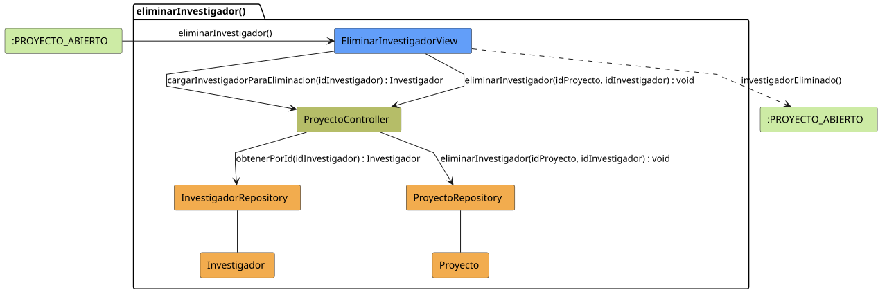

# FUNIBER GIPF > eliminarInvestigador > Análisis

## información del artefacto

- **Proyecto**: FUNIBER GIPF - Plataforma Interna de Investigación
- **Fase**: Análisis
- **Disciplina**: Análisis y Diseño
- **Versión**: 1.0
- **Fecha**: 2026-05-23
- **Autor**: Diego Martínez

## propósito

Análisis de colaboración del caso de uso `eliminarInvestigador()` mediante el patrón MVC, identificando las clases de análisis, sus responsabilidades y colaboraciones necesarias para desvincular un investigador de un proyecto de investigación.

## diagrama de colaboración

||
|-|
|Código fuente: [eliminarInvestigador.puml](../../../modelosUML/analisis/coordinador/eliminarInvestigador.puml)|

## clases de análisis identificadas

### clases de vista (boundary)

#### EliminarInvestigadorView
**Estereotipo**: Vista (Boundary)  
**Responsabilidades**:
- Mostrar confirmación de desvinculación del investigador del proyecto
- Invocar la eliminación de la asociación en el controlador
- Navegar de vuelta al proyecto tras la operación

**Colaboraciones**:
- **Entrada**: Recibe `eliminarInvestigador()` desde `:PROYECTO_ABIERTO`
- **Control**: Se comunica con `ProyectoController`
- **Salida**: Navega a `:PROYECTO_ABIERTO`

### clases de control

#### ProyectoController
**Estereotipo**: Control  
**Responsabilidades**:
- Coordinar el proceso de desvinculación del investigador del proyecto
- Verificar que el investigador pertenece al proyecto
- Invocar la eliminación de la asociación

**Colaboraciones**:
- **Vista**: Responde a solicitudes de `EliminarInvestigadorView`
- **Repositorio**: Delega operaciones a `InvestigadorRepository`

### clases de entidad (entity)

#### InvestigadorRepository
**Estereotipo**: Entidad  
**Responsabilidades**:
- Abstraer el acceso a datos de investigadores
- Proporcionar método para obtener un investigador por identificador

**Colaboraciones**:
- **Control**: Responde a `ProyectoController`
- **Entidad**: Gestiona instancias de `Investigador`

#### Investigador
**Estereotipo**: Entidad  
**Responsabilidades**:
- Representar la información del investigador a desvincular
- Encapsular la relación con los proyectos a los que pertenece

**Colaboraciones**:
- **Repositorio**: Es gestionado por `InvestigadorRepository`

## flujo de colaboración

### secuencia de operaciones

1. **Inicio**: `:PROYECTO_ABIERTO` → `EliminarInvestigadorView.eliminarInvestigador()`
2. **Confirmación**: El Coordinador confirma la desvinculación
3. **Desvinculación**: `EliminarInvestigadorView` → `ProyectoController.eliminarInvestigador(idProyecto, idInvestigador)` : `void`
4. **Verificación**: `ProyectoController` → `InvestigadorRepository.obtenerPorId(id)` : `Investigador`
5. **Finalización**: `EliminarInvestigadorView` → `:PROYECTO_ABIERTO.investigadorEliminado()`

## correspondencia con requisitos

|Requisito del caso de uso|Clase responsable|Método/Colaboración|
|-|-|-|
|Confirmar desvinculación|`EliminarInvestigadorView`|Muestra diálogo de confirmación|
|Desvincular del proyecto|`ProyectoController`|`eliminarInvestigador(idProyecto, idInvestigador)`|
|Verificar investigador|`InvestigadorRepository`|`obtenerPorId(id)`|
|Volver al proyecto|`EliminarInvestigadorView`|→ `:PROYECTO_ABIERTO`|

## características del análisis

### separación de responsabilidades MVC

- **Vista**: Solo presentación de la confirmación e interacción con el Coordinador
- **Control**: Solo coordinación del proceso de desvinculación
- **Entidad**: Solo datos y reglas de negocio del investigador

### agnóstico tecnológicamente

- No especifica tecnología de interfaz de usuario
- No asume implementación específica de base de datos
- Mantiene independencia de frameworks

### trazabilidad completa

- **Origen**: Caso de uso detallado `eliminarInvestigador()`
- **Destino**: Base para diseño arquitectónico
- **Conexión**: Diagrama de estados → Análisis de colaboración

## patrones aplicados

### repository pattern
`InvestigadorRepository` abstrae el acceso a datos, permitiendo diferentes implementaciones sin afectar al controlador.

### mvc pattern
Separación clara entre presentación (`EliminarInvestigadorView`), lógica de aplicación (`ProyectoController`) y datos (`Investigador`, `InvestigadorRepository`).

## referencias

- [Especificación detallada: eliminarInvestigador()](../../../context/casosDeUso/detalle/coordinador/eliminarInvestigador/eliminarInvestigador.md)
- [Modelo del dominio](../../../context/modeloDelDominio/modeloDominio.md)
