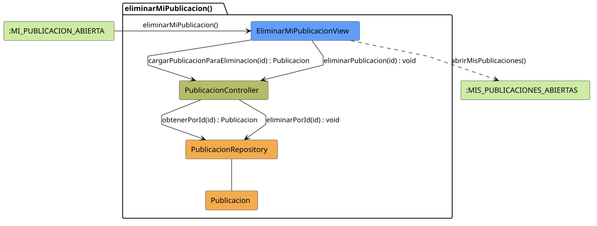

# FUNIBER GIPF > eliminarMiPublicacion > Análisis

## información del artefacto

- **Proyecto**: FUNIBER GIPF - Plataforma Interna de Investigación
- **Fase**: Análisis
- **Disciplina**: Análisis y Diseño
- **Versión**: 1.0
- **Fecha**: 2026-05-23
- **Autor**: Diego Martínez

## propósito

Análisis de colaboración del caso de uso `eliminarMiPublicacion()` mediante el patrón MVC, identificando las clases de análisis, sus responsabilidades y colaboraciones necesarias para eliminar una publicación propia del Coordinador.

## diagrama de colaboración

||
|-|
|Código fuente: [eliminarMiPublicacion.puml](../../../modelosUML/analisis/coordinador/eliminarMiPublicacion.puml)|

## clases de análisis identificadas

### clases de vista (boundary)

#### EliminarMiPublicacionView
**Estereotipo**: Vista (Boundary)  
**Responsabilidades**:
- Mostrar confirmación de eliminación de la publicación propia
- Invocar la eliminación en el controlador tras confirmación
- Navegar a la lista de publicaciones propias tras la operación

**Colaboraciones**:
- **Entrada**: Recibe `eliminarMiPublicacion()` desde `:MI_PUBLICACION_ABIERTA`
- **Control**: Se comunica con `PublicacionController`
- **Salida**: Navega a `:MIS_PUBLICACIONES_ABIERTAS`

### clases de control

#### PublicacionController
**Estereotipo**: Control  
**Responsabilidades**:
- Coordinar el proceso de eliminación de la publicación propia
- Invocar la eliminación en el repositorio

**Colaboraciones**:
- **Vista**: Responde a solicitudes de `EliminarMiPublicacionView`
- **Repositorio**: Delega la eliminación a `PublicacionRepository`

### clases de entidad (entity)

#### PublicacionRepository
**Estereotipo**: Entidad  
**Responsabilidades**:
- Abstraer el acceso a datos de publicaciones
- Proporcionar método para eliminar una publicación por identificador

**Colaboraciones**:
- **Control**: Responde a `PublicacionController`
- **Entidad**: Gestiona instancias de `Publicacion`

#### Publicacion
**Estereotipo**: Entidad  
**Responsabilidades**:
- Representar la publicación propia a eliminar
- Encapsular la información necesaria para la eliminación

**Colaboraciones**:
- **Repositorio**: Es gestionado por `PublicacionRepository`

## flujo de colaboración

### secuencia de operaciones

1. **Inicio**: `:MI_PUBLICACION_ABIERTA` → `EliminarMiPublicacionView.eliminarMiPublicacion()`
2. **Confirmación**: El Coordinador confirma la eliminación
3. **Eliminación**: `EliminarMiPublicacionView` → `PublicacionController.eliminarPublicacion(id)` : `void`
4. **Persistencia**: `PublicacionController` → `PublicacionRepository.eliminarPorId(id)` : `void`
5. **Finalización**: `EliminarMiPublicacionView` → `:MIS_PUBLICACIONES_ABIERTAS.abrirMisPublicaciones()`

## correspondencia con requisitos

|Requisito del caso de uso|Clase responsable|Método/Colaboración|
|-|-|-|
|Confirmar eliminación|`EliminarMiPublicacionView`|Muestra diálogo de confirmación|
|Eliminar publicación propia|`PublicacionController`|`eliminarPublicacion(id)` → `PublicacionRepository.eliminarPorId()`|
|Volver a mis publicaciones|`EliminarMiPublicacionView`|→ `:MIS_PUBLICACIONES_ABIERTAS`|

## características del análisis

### separación de responsabilidades MVC

- **Vista**: Solo presentación de la confirmación e interacción con el Coordinador
- **Control**: Solo coordinación del proceso de eliminación
- **Entidad**: Solo datos y gestión de la persistencia

### agnóstico tecnológicamente

- No especifica tecnología de interfaz de usuario
- No asume implementación específica de base de datos
- Mantiene independencia de frameworks

### trazabilidad completa

- **Origen**: Caso de uso detallado `eliminarMiPublicacion()`
- **Destino**: Base para diseño arquitectónico
- **Conexión**: Diagrama de estados → Análisis de colaboración

## patrones aplicados

### repository pattern
`PublicacionRepository` abstrae el acceso a datos, permitiendo diferentes implementaciones sin afectar al controlador.

### mvc pattern
Separación clara entre presentación (`EliminarMiPublicacionView`), lógica de aplicación (`PublicacionController`) y datos (`Publicacion`, `PublicacionRepository`).

## referencias

- [Especificación detallada: eliminarMiPublicacion()](../../../context/casosDeUso/detalle/coordinador/eliminarMiPublicacion/eliminarPublicacion.md)
- [Modelo del dominio](../../../context/modeloDelDominio/modeloDominio.md)
