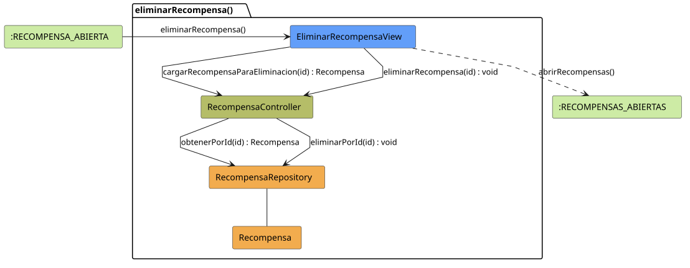

# FUNIBER GIPF > eliminarRecompensa > Análisis

## información del artefacto

- **Proyecto**: FUNIBER GIPF - Plataforma Interna de Investigación
- **Fase**: Análisis
- **Disciplina**: Análisis y Diseño
- **Versión**: 1.0
- **Fecha**: 2026-05-23
- **Autor**: Diego Martínez

## propósito

Análisis de colaboración del caso de uso `eliminarRecompensa()` mediante el patrón MVC, identificando las clases de análisis, sus responsabilidades y colaboraciones necesarias para eliminar una recompensa del sistema.

## diagrama de colaboración

||
|-|
|Código fuente: [eliminarRecompensa.puml](../../../modelosUML/analisis/coordinador/eliminarRecompensa.puml)|

## clases de análisis identificadas

### clases de vista (boundary)

#### EliminarRecompensaView
**Estereotipo**: Vista (Boundary)  
**Responsabilidades**:
- Mostrar confirmación de eliminación de la recompensa al Coordinador
- Invocar la eliminación en el controlador tras confirmación
- Navegar a la lista de recompensas tras la operación

**Colaboraciones**:
- **Entrada**: Recibe `eliminarRecompensa()` desde `:RECOMPENSA_ABIERTA`
- **Control**: Se comunica con `RecompensaController`
- **Salida**: Navega a `:RECOMPENSAS_ABIERTAS`

### clases de control

#### RecompensaController
**Estereotipo**: Control  
**Responsabilidades**:
- Coordinar el proceso de eliminación de la recompensa
- Invocar la eliminación en el repositorio

**Colaboraciones**:
- **Vista**: Responde a solicitudes de `EliminarRecompensaView`
- **Repositorio**: Delega la eliminación a `RecompensaRepository`

### clases de entidad (entity)

#### RecompensaRepository
**Estereotipo**: Entidad  
**Responsabilidades**:
- Abstraer el acceso a datos de recompensas
- Proporcionar método para eliminar una recompensa por identificador

**Colaboraciones**:
- **Control**: Responde a `RecompensaController`
- **Entidad**: Gestiona instancias de `Recompensa`

#### Recompensa
**Estereotipo**: Entidad  
**Responsabilidades**:
- Representar la recompensa a eliminar
- Encapsular la información necesaria para la eliminación

**Colaboraciones**:
- **Repositorio**: Es gestionado por `RecompensaRepository`

## flujo de colaboración

### secuencia de operaciones

1. **Inicio**: `:RECOMPENSA_ABIERTA` → `EliminarRecompensaView.eliminarRecompensa()`
2. **Confirmación**: El Coordinador confirma la eliminación
3. **Eliminación**: `EliminarRecompensaView` → `RecompensaController.eliminarRecompensa(id)` : `void`
4. **Persistencia**: `RecompensaController` → `RecompensaRepository.eliminarPorId(id)` : `void`
5. **Finalización**: `EliminarRecompensaView` → `:RECOMPENSAS_ABIERTAS.abrirRecompensas()`

## correspondencia con requisitos

|Requisito del caso de uso|Clase responsable|Método/Colaboración|
|-|-|-|
|Confirmar eliminación|`EliminarRecompensaView`|Muestra diálogo de confirmación|
|Eliminar recompensa|`RecompensaController`|`eliminarRecompensa(id)` → `RecompensaRepository.eliminarPorId()`|
|Volver a la lista|`EliminarRecompensaView`|→ `:RECOMPENSAS_ABIERTAS`|

## características del análisis

### separación de responsabilidades MVC

- **Vista**: Solo presentación de la confirmación e interacción con el Coordinador
- **Control**: Solo coordinación del proceso de eliminación
- **Entidad**: Solo datos y gestión de la persistencia

### agnóstico tecnológicamente

- No especifica tecnología de interfaz de usuario
- No asume implementación específica de base de datos
- Mantiene independencia de frameworks

### trazabilidad completa

- **Origen**: Caso de uso detallado `eliminarRecompensa()`
- **Destino**: Base para diseño arquitectónico
- **Conexión**: Diagrama de estados → Análisis de colaboración

## patrones aplicados

### repository pattern
`RecompensaRepository` abstrae el acceso a datos, permitiendo diferentes implementaciones sin afectar al controlador.

### mvc pattern
Separación clara entre presentación (`EliminarRecompensaView`), lógica de aplicación (`RecompensaController`) y datos (`Recompensa`, `RecompensaRepository`).

## referencias

- [Especificación detallada: eliminarRecompensa()](../../../context/casosDeUso/detalle/coordinador/eliminarRecompensa/eliminarRecompensa.md)
- [Modelo del dominio](../../../context/modeloDelDominio/modeloDominio.md)
