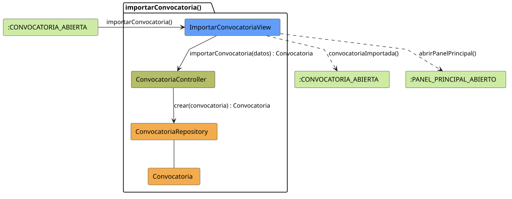

# FUNIBER GIPF > importarConvocatoria > Análisis

## información del artefacto

- **Proyecto**: FUNIBER GIPF - Plataforma Interna de Investigación
- **Fase**: Análisis
- **Disciplina**: Análisis y Diseño
- **Versión**: 1.0
- **Fecha**: 2026-05-23
- **Autor**: Diego Martínez

## propósito

Análisis de colaboración del caso de uso `importarConvocatoria()` mediante el patrón MVC, identificando las clases de análisis, sus responsabilidades y colaboraciones necesarias para importar una convocatoria externa al sistema de proyectos de FUNIBER GIPF.

## diagrama de colaboración

||
|-|
|Código fuente: [importarConvocatoria.puml](../../../modelosUML/analisis/coordinador/importarConvocatoria.puml)|

## clases de análisis identificadas

### clases de vista (boundary)

#### ImportarConvocatoriaView
**Estereotipo**: Vista (Boundary)  
**Responsabilidades**:
- Presentar el formulario de importación de convocatoria al Coordinador
- Capturar los datos de la convocatoria a importar
- Invocar el proceso de importación en el controlador
- Navegar de vuelta a la convocatoria o al panel principal tras la importación

**Colaboraciones**:
- **Entrada**: Recibe `importarConvocatoria()` desde `:CONVOCATORIA_ABIERTA`
- **Control**: Se comunica con `ConvocatoriaController`
- **Salida**: Navega a `:CONVOCATORIA_ABIERTA` o `:PANEL_PRINCIPAL_ABIERTO`

### clases de control

#### ConvocatoriaController
**Estereotipo**: Control  
**Responsabilidades**:
- Coordinar el proceso de importación de la convocatoria
- Transformar los datos externos al formato interno del sistema
- Persistir la convocatoria importada a través del repositorio

**Colaboraciones**:
- **Vista**: Responde a solicitudes de `ImportarConvocatoriaView`
- **Repositorio**: Delega la persistencia a `ConvocatoriaRepository`

### clases de entidad (entity)

#### ConvocatoriaRepository
**Estereotipo**: Entidad  
**Responsabilidades**:
- Abstraer el acceso a datos de convocatorias
- Proporcionar método para crear una nueva convocatoria importada

**Colaboraciones**:
- **Control**: Responde a `ConvocatoriaController`
- **Entidad**: Gestiona instancias de `Convocatoria`

#### Convocatoria
**Estereotipo**: Entidad  
**Responsabilidades**:
- Representar la información de la convocatoria importada
- Encapsular atributos: título, área, estado, fechas, descripción, requisitos, criterios, documentación, contacto

**Colaboraciones**:
- **Repositorio**: Es gestionado por `ConvocatoriaRepository`

## flujo de colaboración

### secuencia de operaciones

1. **Inicio**: `:CONVOCATORIA_ABIERTA` → `ImportarConvocatoriaView.importarConvocatoria()`
2. **Captura**: El Coordinador introduce o confirma los datos de importación
3. **Importación**: `ImportarConvocatoriaView` → `ConvocatoriaController.importarConvocatoria(datos)` : `Convocatoria`
4. **Persistencia**: `ConvocatoriaController` → `ConvocatoriaRepository.crear(convocatoria)` : `Convocatoria`
5. **Finalización**: `ImportarConvocatoriaView` → `:CONVOCATORIA_ABIERTA.convocatoriaImportada()`

## correspondencia con requisitos

|Requisito del caso de uso|Clase responsable|Método/Colaboración|
|-|-|-|
|Presentar formulario de importación|`ImportarConvocatoriaView`|Captura datos de la convocatoria|
|Procesar importación|`ConvocatoriaController`|`importarConvocatoria(datos)` → `ConvocatoriaRepository.crear()`|
|Confirmar importación|`ImportarConvocatoriaView`|→ `:CONVOCATORIA_ABIERTA`|

## características del análisis

### separación de responsabilidades MVC

- **Vista**: Solo presentación del formulario e interacción con el Coordinador
- **Control**: Solo coordinación de la lógica de importación
- **Entidad**: Solo datos y reglas de negocio de la convocatoria

### agnóstico tecnológicamente

- No especifica tecnología de interfaz de usuario
- No asume implementación específica de base de datos
- Mantiene independencia de frameworks

### trazabilidad completa

- **Origen**: Caso de uso detallado `importarConvocatoria()`
- **Destino**: Base para diseño arquitectónico
- **Conexión**: Diagrama de estados → Análisis de colaboración

## patrones aplicados

### repository pattern
`ConvocatoriaRepository` abstrae el acceso a datos, permitiendo diferentes implementaciones sin afectar al controlador.

### mvc pattern
Separación clara entre presentación (`ImportarConvocatoriaView`), lógica de aplicación (`ConvocatoriaController`) y datos (`Convocatoria`, `ConvocatoriaRepository`).

## referencias

- [Especificación detallada: importarConvocatoria()](../../../context/casosDeUso/detalle/coordinador/importarConvocatoria/importarConvocatoria.md)
- [Modelo del dominio](../../../context/modeloDelDominio/modeloDominio.md)
