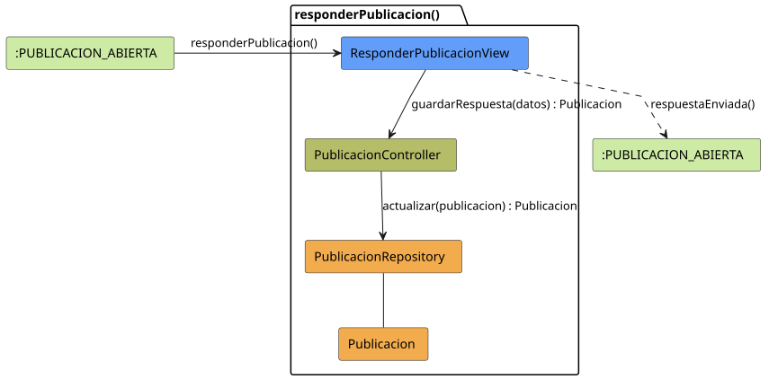

# FUNIBER GIPF > responderPublicacion > Análisis

## información del artefacto

- **Proyecto**: FUNIBER GIPF - Plataforma Interna de Investigación
- **Fase**: Análisis
- **Disciplina**: Análisis y Diseño
- **Versión**: 1.0
- **Fecha**: 2026-05-23
- **Autor**: Diego Martínez

## propósito

Análisis de colaboración del caso de uso `responderPublicacion()` mediante el patrón MVC, identificando las clases de análisis, sus responsabilidades y colaboraciones necesarias para que el Coordinador añada una respuesta a una publicación.

## diagrama de colaboración

||
|-|
|Código fuente: [responderPublicacion.puml](../../../modelosUML/analisis/coordinador/responderPublicacion.puml)|

## clases de análisis identificadas

### clases de vista (boundary)

#### ResponderPublicacionView
**Estereotipo**: Vista (Boundary)  
**Responsabilidades**:
- Presentar el formulario de respuesta a la publicación al Coordinador
- Capturar el contenido de la respuesta
- Invocar el guardado en el controlador
- Navegar de vuelta a la publicación tras enviar la respuesta

**Colaboraciones**:
- **Entrada**: Recibe `responderPublicacion()` desde `:PUBLICACION_ABIERTA`
- **Control**: Se comunica con `PublicacionController`
- **Salida**: Navega a `:PUBLICACION_ABIERTA`

### clases de control

#### PublicacionController
**Estereotipo**: Control  
**Responsabilidades**:
- Coordinar el proceso de guardado de la respuesta
- Actualizar la publicación con la nueva respuesta
- Servir como intermediario entre la vista y el repositorio

**Colaboraciones**:
- **Vista**: Responde a solicitudes de `ResponderPublicacionView`
- **Repositorio**: Delega la persistencia a `PublicacionRepository`

### clases de entidad (entity)

#### PublicacionRepository
**Estereotipo**: Entidad  
**Responsabilidades**:
- Abstraer el acceso a datos de publicaciones
- Proporcionar método para actualizar una publicación con su respuesta

**Colaboraciones**:
- **Control**: Responde a `PublicacionController`
- **Entidad**: Gestiona instancias de `Publicacion`

#### Publicacion
**Estereotipo**: Entidad  
**Responsabilidades**:
- Representar la publicación y sus respuestas
- Encapsular la respuesta del Coordinador junto a los datos originales

**Colaboraciones**:
- **Repositorio**: Es gestionado por `PublicacionRepository`

## flujo de colaboración

### secuencia de operaciones

1. **Inicio**: `:PUBLICACION_ABIERTA` → `ResponderPublicacionView.responderPublicacion()`
2. **Captura**: El Coordinador redacta la respuesta
3. **Guardado**: `ResponderPublicacionView` → `PublicacionController.guardarRespuesta(datos)` : `Publicacion`
4. **Persistencia**: `PublicacionController` → `PublicacionRepository.actualizar(publicacion)` : `Publicacion`
5. **Finalización**: `ResponderPublicacionView` → `:PUBLICACION_ABIERTA.respuestaEnviada()`

## correspondencia con requisitos

|Requisito del caso de uso|Clase responsable|Método/Colaboración|
|-|-|-|
|Presentar formulario de respuesta|`ResponderPublicacionView`|Captura contenido de la respuesta|
|Guardar respuesta|`PublicacionController`|`guardarRespuesta(datos)` → `PublicacionRepository.actualizar()`|
|Confirmar envío|`ResponderPublicacionView`|→ `:PUBLICACION_ABIERTA`|

## características del análisis

### separación de responsabilidades MVC

- **Vista**: Solo presentación del formulario e interacción con el Coordinador
- **Control**: Solo coordinación del proceso de respuesta
- **Entidad**: Solo datos y reglas de negocio de la publicación

### agnóstico tecnológicamente

- No especifica tecnología de interfaz de usuario
- No asume implementación específica de base de datos
- Mantiene independencia de frameworks

### trazabilidad completa

- **Origen**: Caso de uso detallado `responderPublicacion()`
- **Destino**: Base para diseño arquitectónico
- **Conexión**: Diagrama de estados → Análisis de colaboración

## patrones aplicados

### repository pattern
`PublicacionRepository` abstrae el acceso a datos, permitiendo diferentes implementaciones sin afectar al controlador.

### mvc pattern
Separación clara entre presentación (`ResponderPublicacionView`), lógica de aplicación (`PublicacionController`) y datos (`Publicacion`, `PublicacionRepository`).

## referencias

- [Especificación detallada: responderPublicacion()](../../../context/casosDeUso/detalle/coordinador/responderPublicacion/responderPublicacion.md)
- [Modelo del dominio](../../../context/modeloDelDominio/modeloDominio.md)
