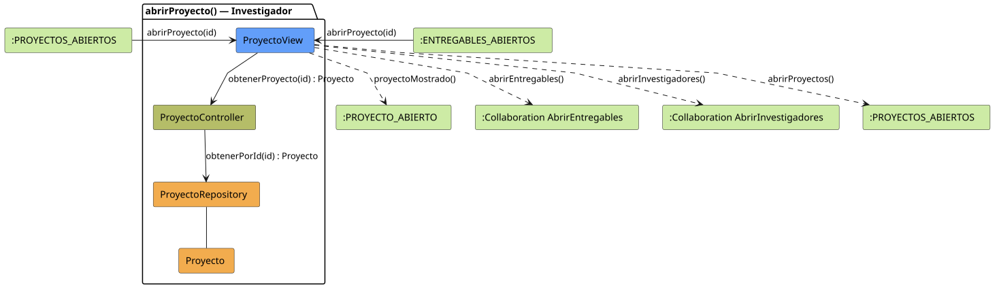

# FUNIBER GIPF > abrirProyecto > Análisis (Investigador)

## información del artefacto

- **Proyecto**: FUNIBER GIPF - Plataforma Interna de Investigación
- **Fase**: Análisis
- **Disciplina**: Análisis y Diseño
- **Actor**: Investigador
- **Versión**: 1.0
- **Fecha**: 2026-06-03
- **Autor**: Diego Martínez

## propósito

Análisis de colaboración del caso de uso `abrirProyecto()` del Investigador mediante el patrón MVC. El Investigador puede ver el detalle de un proyecto en el que participa, así como acceder a sus entregables y a la lista de investigadores. No dispone de acciones de gestión sobre el proyecto (editar, eliminar, agregar/eliminar miembros).

## diagrama de colaboración

||
|-|
|Código fuente: [abrirProyecto.puml](../../../modelosUML/analisis/investigador/abrirProyecto.puml)|

## clases de análisis identificadas

### clases de vista (boundary)

#### ProyectoView
**Estereotipo**: Vista (Boundary)  
**Responsabilidades**:
- Presentar el detalle del proyecto al Investigador
- Mostrar información del proyecto: título, descripción, estado, fechas, equipo
- Ofrecer acceso a los entregables del proyecto y a la lista de investigadores
- Navegar de vuelta a la lista de proyectos propios

**Colaboraciones**:
- **Entrada**: Recibe `abrirProyecto(id)` desde `:PROYECTOS_ABIERTOS` o `:ENTREGABLES_ABIERTOS`
- **Control**: Se comunica con `ProyectoController`
- **Salida**: Navega a `:PROYECTO_ABIERTO` y a colaboraciones `AbrirEntregables` y `AbrirInvestigadores`

### clases de control

#### ProyectoController
**Estereotipo**: Control  
**Responsabilidades**:
- Coordinar la obtención del detalle del proyecto solicitado
- Servir como intermediario entre la vista y el repositorio

**Colaboraciones**:
- **Vista**: Responde a solicitudes de `ProyectoView`
- **Repositorio**: Delega el acceso a datos a `ProyectoRepository`

### clases de entidad (entity)

#### ProyectoRepository
**Estereotipo**: Entidad  
**Responsabilidades**:
- Abstraer el acceso a datos de proyectos
- Proporcionar método para obtener un proyecto por identificador

**Colaboraciones**:
- **Control**: Responde a `ProyectoController`
- **Entidad**: Gestiona instancias de `Proyecto`

#### Proyecto
**Estereotipo**: Entidad  
**Responsabilidades**:
- Representar la información completa del proyecto
- Encapsular atributos: título, descripción, estado, fechas de inicio y fin, equipo de investigadores

**Colaboraciones**:
- **Repositorio**: Es gestionado por `ProyectoRepository`

## flujo de colaboración

### secuencia de operaciones

1. **Inicio**: `:PROYECTOS_ABIERTOS` → `ProyectoView.abrirProyecto(id)`
2. **Obtención de datos**: `ProyectoView` → `ProyectoController.obtenerProyecto(id)` : `Proyecto`
3. **Acceso a datos**: `ProyectoController` → `ProyectoRepository.obtenerPorId(id)` : `Proyecto`
4. **Presentación**: `ProyectoView` → `:PROYECTO_ABIERTO.proyectoMostrado()`
5. **Navegación**: El Investigador puede acceder a los entregables o a la lista de investigadores del proyecto

## correspondencia con requisitos

|Requisito del caso de uso|Clase responsable|Método/Colaboración|
|-|-|-|
|Mostrar detalle del proyecto|`ProyectoView`|Coordina con `ProyectoController.obtenerProyecto(id)`|
|Datos del proyecto|`Proyecto`|Encapsula todos los atributos|
|Acceso a datos|`ProyectoRepository`|`obtenerPorId(id)`|
|Acceder a entregables|`ProyectoView`|→ Colaboración `AbrirEntregables`|
|Ver investigadores del proyecto|`ProyectoView`|→ Colaboración `AbrirInvestigadores`|
|Volver a la lista|`ProyectoView`|→ `:PROYECTOS_ABIERTOS`|

## diferencias respecto al análisis del Coordinador

| Aspecto | Coordinador | Investigador |
|---|---|---|
| Editar proyecto | Sí → `EditarProyecto` | No |
| Eliminar proyecto | Sí → `EliminarProyecto` | No |
| Agregar/eliminar investigador | Sí → `AgregarInvestigador` | No |
| Acceder a entregables | Sí | Sí |
| Ver investigadores | Sí | Sí |

## características del análisis

### separación de responsabilidades MVC

- **Vista**: Solo presentación e interacción con el Investigador
- **Control**: Solo coordinación y obtención del detalle
- **Entidad**: Solo datos y reglas de negocio del proyecto

### agnóstico tecnológicamente

- No especifica tecnología de interfaz de usuario
- No asume implementación específica de base de datos
- Mantiene independencia de frameworks

## referencias

- [Especificación detallada: abrirProyecto() — Investigador](../../../context/casosDeUso/detalle/investigador/abrirProyecto/abrirProyecto.puml)
- [Diferencias entre actores](../../diferenciasActores.md)
- [Análisis abrirProyecto — Coordinador](../coordinador/abrirProyecto.md)
