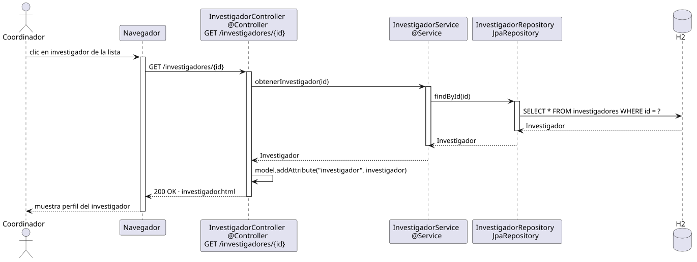

# abrirInvestigador — Diseño

## Información del artefacto

- **Proyecto**: FUNIBER GIPF
- **Fase RUP**: Elaboración
- **Disciplina**: Diseño
- **Actor**: Coordinador
- **Caso de uso**: abrirInvestigador()

## Propósito

Recuperar y mostrar el perfil completo de un investigador dado su identificador.

## Diagrama de secuencia

[Código PlantUML](../../../modelosUML/diseño/coordinador/abrirInvestigador.puml)

## Participantes

| Análisis | Spring Boot | Rol |
|---|---|---|
| InvestigadorView (azul) | `InvestigadorController` `@Controller` | Recibe GET /investigadores/{id}; carga el investigador y devuelve investigador.html |
| InvestigadorController (amarillo) | `InvestigadorService` `@Service` | Recupera el investigador por id con orElseThrow() |
| InvestigadorRepository (naranja) | `InvestigadorRepository` JpaRepository | Ejecuta SELECT por id |
| Investigador (naranja) | `Investigador` `@Entity` | Tabla investigadores en H2 |

## Rutas

| Método | URL | Acción |
|---|---|---|
| GET | /investigadores/{id} | Muestra el perfil del investigador |

## Decisiones de diseño

- Si el id no existe, `orElseThrow()` lanza excepción y Spring devuelve 404.
- El perfil muestra: id, nombre, apellidos, campo, carrera, master, email, institución y rol.
- La vista ofrece enlace de vuelta a la lista `/investigadores`.
- El cambio de rol se gestiona desde `abrirOpcionesPerfil` (`GET /investigadores/{id}/opciones`), no desde esta vista.
