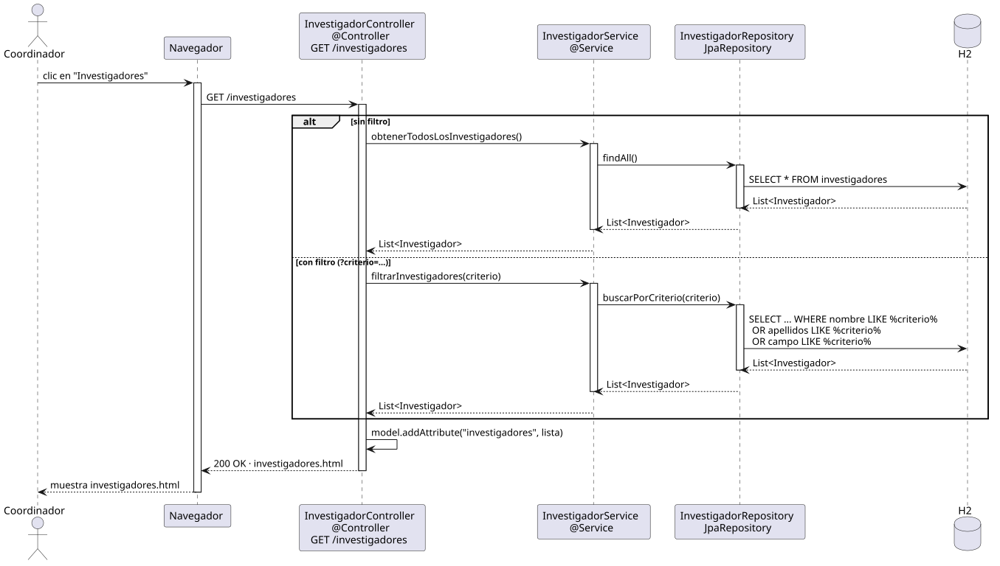

# abrirInvestigadores — Diseño

## Información del artefacto

- **Proyecto**: FUNIBER GIPF
- **Fase RUP**: Elaboración
- **Disciplina**: Diseño
- **Actor**: Coordinador
- **Caso de uso**: abrirInvestigadores()

## Propósito

Recuperar y mostrar la lista de investigadores del sistema. Soporta búsqueda por criterio de texto.

## Diagrama de secuencia

[Código PlantUML](../../../modelosUML/diseño/coordinador/abrirInvestigadores.puml)

## Participantes

| Análisis | Spring Boot | Rol |
|---|---|---|
| InvestigadoresView (azul) | `InvestigadoresController` `@Controller` | Recibe GET /investigadores; pone la lista en el Model y devuelve investigadores.html |
| InvestigadoresController (amarillo) | `InvestigadoresService` `@Service` | Orquesta la consulta: sin filtro llama findAll(), con filtro llama buscarPorCriterio() |
| InvestigadorRepository (naranja) | `InvestigadorRepository` JpaRepository | Ejecuta la query SQL contra H2 |
| Investigador (naranja) | `Investigador` `@Entity` | Tabla investigadores en H2 |

## Rutas

| Método | URL | Acción |
|---|---|---|
| GET | /investigadores | Lista todos los investigadores |
| GET | /investigadores?criterio=texto | Lista investigadores filtrados |

## Decisiones de diseño

- El filtro se pasa como `@RequestParam` opcional; si está vacío o ausente se devuelven todos.
- El método del repositorio `buscarPorCriterio` usa `@Query` con `LIKE` sobre nombre, apellidos y campo.
- Thymeleaf recibe la lista como `model.addAttribute("investigadores", lista)`.
