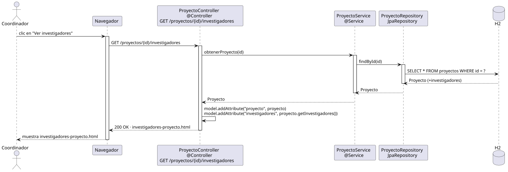

# abrirInvestigadoresDeProyecto — Diseño

## Información del artefacto

- **Proyecto**: FUNIBER GIPF
- **Fase RUP**: Elaboración
- **Disciplina**: Diseño
- **Actor**: Coordinador
- **Caso de uso**: abrirInvestigadoresDeProyecto(id)

## Propósito

Recuperar y mostrar la lista de investigadores asignados a un proyecto concreto, identificado por su id. Difiere de `abrirInvestigadores()` en que el scope está limitado al equipo del proyecto.

## Diagrama de secuencia

[Código PlantUML](../../../modelosUML/diseño/coordinador/abrirInvestigadoresDeProyecto.puml)

## Participantes

| Análisis | Spring Boot | Rol |
|---|---|---|
| InvestigadoresProyectoView (azul) | `InvestigadoresProyectoController` `@Controller` | Recibe GET /proyectos/{id}/investigadores; pone el proyecto y sus investigadores en el Model y devuelve investigadores-proyecto.html |
| InvestigadorController (amarillo) | `ProyectoService` `@Service` | Llama a obtenerProyecto(id); los investigadores se obtienen de la relación @ManyToMany ya cargada |
| ProyectoRepository (naranja) | `ProyectoRepository` JpaRepository | Ejecuta SELECT WHERE id = ? |
| Proyecto + Investigador (naranja) | `Proyecto` + `Investigador` `@Entity` | Relación ManyToMany; proyecto.getInvestigadores() devuelve la lista |

## Rutas

| Método | URL | Acción |
|---|---|---|
| GET | /proyectos/{id}/investigadores | Muestra los investigadores del proyecto |

## Decisiones de diseño

- El id llega como `@PathVariable Long id`.
- No se necesita nuevo método en el servicio: `proyectoService.obtenerProyecto(id)` ya devuelve la entidad con su colección `investigadores`.
- El acceso está restringido a `COORDINADOR` mediante `@PreAuthorize("hasRole('COORDINADOR')")`.
- La vista enlaza a `abrirInvestigador` para cada investigador y ofrece volver al proyecto.
- El enlace de entrada se añade en `proyecto.html` bajo el bloque `sec:authorize="hasRole('COORDINADOR')"`.
