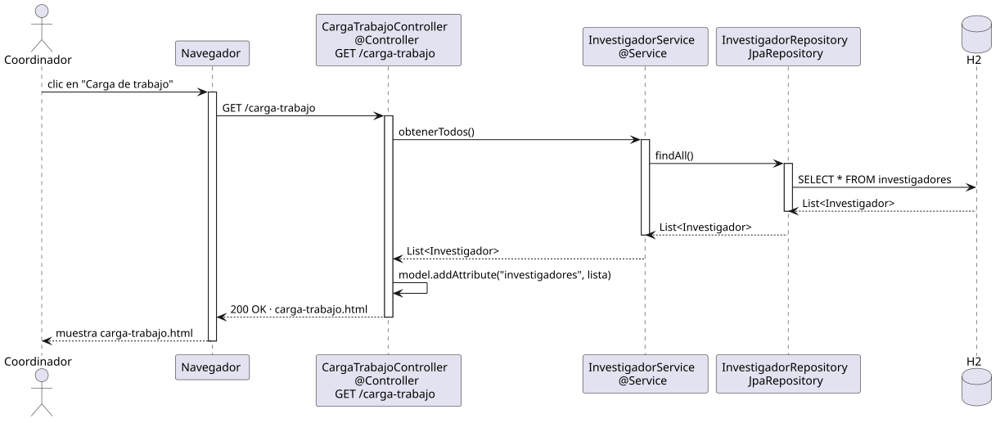

# abrirOpcionesCargaTrabajo — Diseño

## Información del artefacto

- **Proyecto**: FUNIBER GIPF
- **Fase RUP**: Elaboración
- **Disciplina**: Diseño
- **Actor**: Coordinador
- **Caso de uso**: abrirOpcionesCargaTrabajo()

## Propósito

Recuperar y mostrar el resumen de carga de trabajo de todos los investigadores del sistema.

## Diagrama de secuencia

[Código PlantUML](../../../modelosUML/diseño/coordinador/abrirOpcionesCargaTrabajo.puml)

## Participantes

| Análisis | Spring Boot | Rol |
|---|---|---|
| CargaTrabajoView | `CargaTrabajoController` `@Controller` | Recibe GET /carga-trabajo; pone la lista en el Model y devuelve carga-trabajo.html |
| CargaTrabajoController | `InvestigadorService` `@Service` | Orquesta la obtención de todos los investigadores |
| InvestigadorRepository | `InvestigadorRepository` JpaRepository | Ejecuta la query SQL contra H2 |
| Investigador | `Investigador` `@Entity` | Tabla investigadores en H2 |

## Rutas

| Método | URL | Acción |
|---|---|---|
| GET | /carga-trabajo | Lista todos los investigadores con su carga de trabajo |

## Decisiones de diseño

- Se reutiliza `InvestigadorService` ya existente; no se crea un servicio específico.
- La vista muestra los proyectos activos de cada investigador derivados de la relación `Investigador ↔ Proyecto`.
- Thymeleaf itera la lista con `th:each` para construir la tabla de carga.
