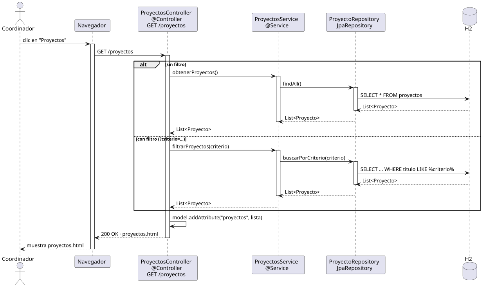

# abrirProyectos — Diseño

## Información del artefacto

- **Proyecto**: FUNIBER GIPF
- **Fase RUP**: Elaboración
- **Disciplina**: Diseño
- **Actor**: Coordinador
- **Caso de uso**: abrirProyectos()

## Propósito

Recuperar y mostrar la lista de proyectos del sistema. Soporta búsqueda por criterio de texto.

## Diagrama de secuencia

[Código PlantUML](../../../modelosUML/diseño/coordinador/abrirProyectos.puml)

## Participantes

| Análisis | Spring Boot | Rol |
|---|---|---|
| ProyectosView (azul) | `ProyectosController` `@Controller` | Recibe GET /proyectos; pone la lista en el Model y devuelve proyectos.html |
| ProyectosController (amarillo) | `ProyectosService` `@Service` | Orquesta la consulta: sin filtro llama findAll(), con filtro llama buscarPorCriterio() |
| ProyectoRepository (naranja) | `ProyectoRepository` JpaRepository | Ejecuta la query SQL contra H2 |
| Proyecto (naranja) | `Proyecto` `@Entity` | Tabla proyectos en H2 |

## Rutas

| Método | URL | Acción |
|---|---|---|
| GET | /proyectos | Lista todos los proyectos |
| GET | /proyectos?criterio=texto | Lista proyectos filtrados |

## Decisiones de diseño

- El filtro se pasa como `@RequestParam` opcional; si está vacío o ausente se devuelven todos.
- El método del repositorio `buscarPorCriterio` usa `@Query` con `LIKE` sobre título y descripción.
- Thymeleaf recibe la lista como `model.addAttribute("proyectos", lista)`.
