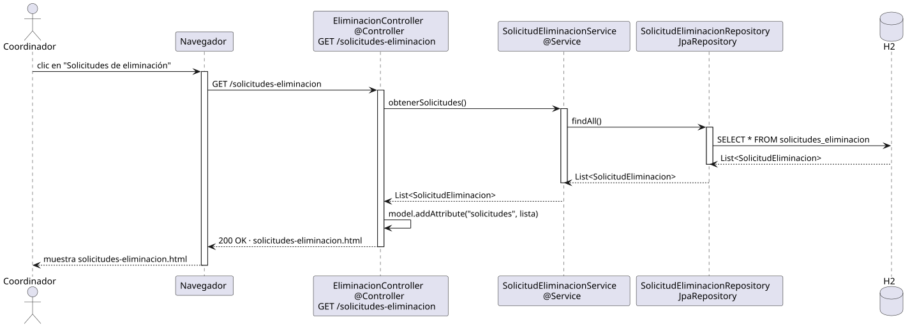

# abrirSolicitudesEliminacionPerfil — Diseño

## Información del artefacto

- **Proyecto**: FUNIBER GIPF
- **Fase RUP**: Elaboración
- **Disciplina**: Diseño
- **Actor**: Coordinador
- **Caso de uso**: abrirSolicitudesEliminacionPerfil()

## Propósito

Recuperar y mostrar la lista de todas las solicitudes de eliminación de perfil registradas en el sistema, permitiendo al coordinador acceder al detalle de cada una.

## Diagrama de secuencia

[Código PlantUML](../../../modelosUML/diseño/coordinador/abrirSolicitudesEliminacionPerfil.puml)

## Participantes

| Análisis | Spring Boot | Rol |
|---|---|---|
| SolicitudesEliminacionView (azul) | `SolicitudesEliminacionController` `@Controller` | Recibe GET /solicitudes-eliminacion; pone la lista en el Model y devuelve solicitudes-eliminacion.html |
| EliminacionController (amarillo) | `SolicitudEliminacionService` `@Service` | Llama a findAll() a través del repositorio |
| SolicitudEliminacionRepository (naranja) | `SolicitudEliminacionRepository` JpaRepository | Ejecuta SELECT * FROM solicitudes_eliminacion |
| SolicitudEliminacion (naranja) | `SolicitudEliminacion` `@Entity` | Tabla solicitudes_eliminacion en H2 |

## Rutas

| Método | URL | Acción |
|---|---|---|
| GET | /solicitudes-eliminacion | Lista todas las solicitudes de eliminación de perfil |

## Decisiones de diseño

- Acceso restringido a `COORDINADOR` mediante `@PreAuthorize("hasRole('COORDINADOR')")`.
- `SolicitudEliminacion` es una entidad nueva con campos: `investigador` (ManyToOne), `motivo`, `fecha`, `estado` (PENDIENTE / ACEPTADA / RECHAZADA).
- El servicio delega directamente en `findAll()` sin filtrado — el coordinador ve todas las solicitudes.
- La vista enlaza a `abrirSolicitudEliminacionPerfil` para cada fila y ofrece volver al panel.
- El enlace de entrada se añade en `panel.html` bajo `sec:authorize="hasRole('COORDINADOR')"`.
