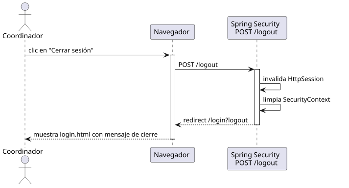

# cerrarSesion — Diseño

## Información del artefacto

- **Proyecto**: FUNIBER GIPF
- **Fase RUP**: Elaboración
- **Disciplina**: Diseño
- **Actor**: Coordinador
- **Caso de uso**: cerrarSesion()

## Propósito

Invalidar la sesión activa del usuario y redirigirle al formulario de inicio de sesión.

## Diagrama de secuencia

[Código PlantUML](../../../modelosUML/diseño/coordinador/cerrarSesion.puml)

## Participantes

| Análisis | Spring Boot | Rol |
|---|---|---|
| SesionController | Spring Security `LogoutFilter` | Intercepta POST /logout; invalida la sesión y limpia el SecurityContext |

## Rutas

| Método | URL | Acción |
|---|---|---|
| POST | /logout | Spring Security invalida la sesión; redirige a /login?logout |

## Decisiones de diseño

- No existe un controlador propio; Spring Security gestiona el logout íntegramente mediante `LogoutFilter`.
- Se usa POST (no GET) para evitar que peticiones de terceros puedan cerrar la sesión del usuario (protección CSRF).
- Tras el logout redirige a `/login?logout`, configurado con `logoutSuccessUrl` en `SecurityConfig`.
