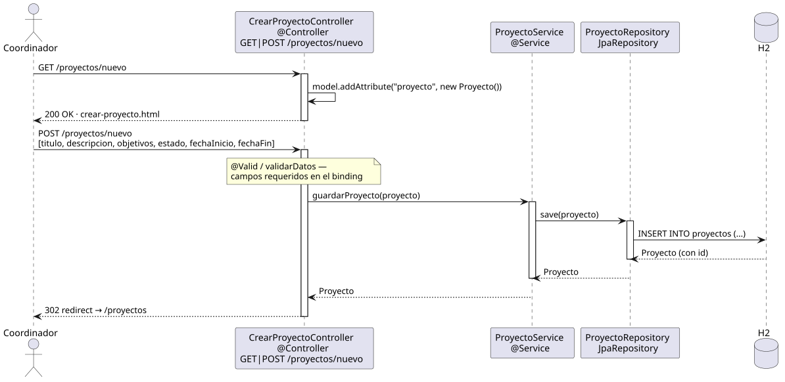

# crearProyecto — Diseño

## Información del artefacto

- **Proyecto**: FUNIBER GIPF
- **Fase RUP**: Elaboración
- **Disciplina**: Diseño
- **Actor**: Coordinador
- **Caso de uso**: crearProyecto()

## Propósito

Mostrar el formulario de creación y persistir un nuevo proyecto tras validar los datos mínimos.

## Diagrama de secuencia

[Código PlantUML](../../../modelosUML/diseño/coordinador/crearProyecto.puml)

## Participantes

| Análisis | Spring Boot | Rol |
|---|---|---|
| CrearProyectoView (azul) | `CrearProyectoController` `@Controller` | GET devuelve el formulario vacío; POST recibe los datos y guarda |
| ProyectoController (amarillo) | `ProyectoService` `@Service` | Llama a save(proyecto) |
| ProyectoRepository (naranja) | `ProyectoRepository` JpaRepository | Ejecuta INSERT INTO proyectos |
| Proyecto (naranja) | `Proyecto` `@Entity` | Tabla proyectos en H2 |

## Rutas

| Método | URL | Acción |
|---|---|---|
| GET | /proyectos/nuevo | Muestra el formulario vacío |
| POST | /proyectos/nuevo | Guarda el nuevo proyecto |

## Campos del formulario

| Campo | Tipo | Requerido |
|---|---|---|
| titulo | String | Sí |
| descripcion | Texto largo | No |
| objetivos | Texto largo | No |
| estado | String (selector) | Sí |
| fechaInicio | LocalDate | No |
| fechaFin | LocalDate | No |

## Decisiones de diseño

- El formulario usa `th:object="${proyecto}"` y `th:field="*{campo}"` para el binding automático.
- El POST recibe un `@ModelAttribute Proyecto` — Spring hace el binding de los campos del formulario al objeto.
- La validación mínima (análisis: `validarDatos`) se hace mediante el binding: si un campo requerido llega vacío, el POST no guarda (pendiente `@Valid` con Bean Validation).
- Tras guardar, redirige a `/proyectos` (PRG pattern — Post/Redirect/Get).
- El estado tiene opciones: EN_PROPUESTA, EN_CURSO, COMPLETADO, CANCELADO.
