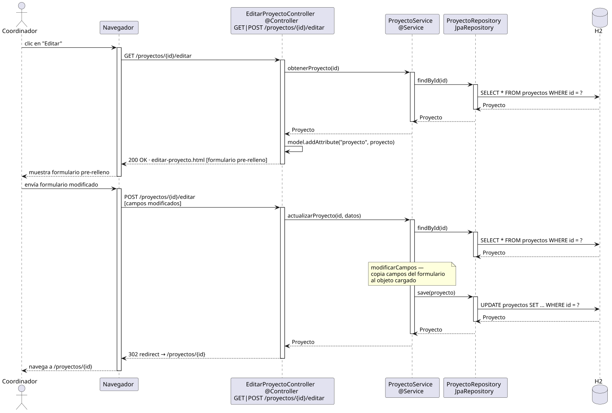

# editarProyecto — Diseño

## Información del artefacto

- **Proyecto**: FUNIBER GIPF
- **Fase RUP**: Elaboración
- **Disciplina**: Diseño
- **Actor**: Coordinador
- **Caso de uso**: editarProyecto()

## Propósito

Cargar un proyecto existente en un formulario pre-rellenado, aplicar las modificaciones del usuario y persistir el resultado.

## Diagrama de secuencia

[Código PlantUML](../../../modelosUML/diseño/coordinador/editarProyecto.puml)

## Participantes

| Análisis | Spring Boot | Rol |
|---|---|---|
| EditarProyectoView (azul) | `EditarProyectoController` `@Controller` | GET carga y muestra el formulario; POST aplica cambios y persiste |
| ProyectoController (amarillo) | `ProyectoService` `@Service` | `obtenerProyecto(id)` para la carga; `actualizarProyecto(id, datos)` para el guardado |
| ProyectoRepository (naranja) | `ProyectoRepository` JpaRepository | SELECT (carga) + UPDATE (guardado) |
| Proyecto (naranja) | `Proyecto` `@Entity` | Tabla proyectos en H2 |

## Rutas

| Método | URL | Acción |
|---|---|---|
| GET | /proyectos/{id}/editar | Muestra el formulario pre-rellenado |
| POST | /proyectos/{id}/editar | Aplica los cambios y persiste |

## Decisiones de diseño

- El GET hace `findById(id)` y pasa el objeto al template con `th:object`.
- El `modificarCampos` del análisis se implementa en `actualizarProyecto()` del servicio: carga el objeto de BD y copia campo a campo desde el formulario. Esto evita que el POST sobrescriba campos no editables (como el id).
- Tras guardar, redirige a `/proyectos/{id}` para mostrar el resultado (PRG pattern).
