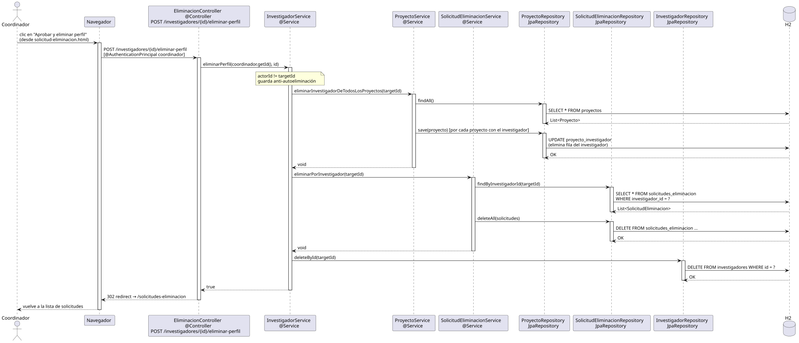

# eliminarPerfil — Diseño

## Información del artefacto

- **Proyecto**: FUNIBER GIPF
- **Fase RUP**: Elaboración
- **Disciplina**: Diseño
- **Actor**: Coordinador
- **Caso de uso**: eliminarPerfil(id)

## Propósito

Eliminar definitivamente el perfil de un investigador del sistema. El coordinador accede desde las opciones de perfil de ese investigador. No puede eliminar su propio perfil.

## Diagrama de secuencia

[Código PlantUML](../../../modelosUML/diseño/coordinador/eliminarPerfil.puml)

## Participantes

| Análisis | Spring Boot | Rol |
|---|---|---|
| EliminarPerfilView (azul) | `EliminarPerfilController` `@Controller` | GET muestra confirmación; POST ejecuta la eliminación |
| EliminacionController (amarillo) | `InvestigadorService` `@Service` | Orquesta la eliminación en tres pasos |
| Repositorios (naranja) | `ProyectoRepository`, `SolicitudEliminacionRepository`, `InvestigadorRepository` | Cada uno ejecuta su operación en BD |

## Rutas

| Método | URL | Acción |
|---|---|---|
| GET | /investigadores/{id}/eliminar-perfil | Muestra la página de confirmación |
| POST | /investigadores/{id}/eliminar-perfil | Elimina el perfil |

## Decisiones de diseño

- Acceso restringido a `COORDINADOR` mediante `@PreAuthorize("hasRole('COORDINADOR')")`.
- Si el coordinador intenta eliminar su propio perfil (id == coordinador.getId()), se redirige a sus propias opciones.
- La eliminación es un proceso en tres pasos en `InvestigadorService.eliminarPerfil(id)` anotado con `@Transactional`:
  1. Quitar al investigador de todos los proyectos donde aparece.
  2. Eliminar sus solicitudes de eliminación (integridad referencial).
  3. Eliminar el investigador.
- Tras el POST, redirige a `/investigadores`.
