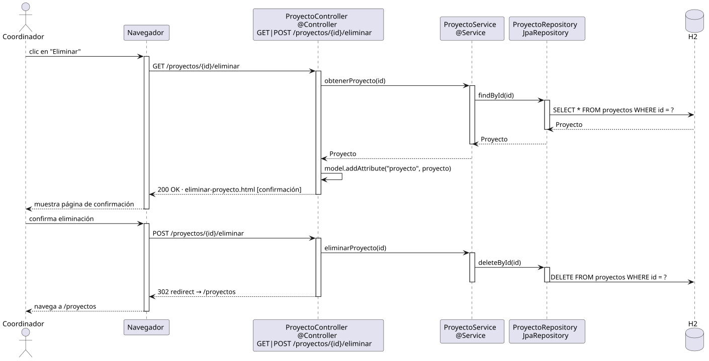

# eliminarProyecto — Diseño

## Información del artefacto

- **Proyecto**: FUNIBER GIPF
- **Fase RUP**: Elaboración
- **Disciplina**: Diseño
- **Actor**: Coordinador
- **Caso de uso**: eliminarProyecto()

## Propósito

Mostrar la ficha del proyecto a eliminar como confirmación, y borrarlo definitivamente tras la confirmación del usuario.

## Diagrama de secuencia

[Código PlantUML](../../../modelosUML/diseño/coordinador/eliminarProyecto.puml)

## Participantes

| Análisis | Spring Boot | Rol |
|---|---|---|
| EliminarProyectoView (azul) | `EliminarProyectoController` `@Controller` | GET muestra la confirmación; POST ejecuta el borrado |
| ProyectoController (amarillo) | `ProyectoService` `@Service` | `obtenerProyecto(id)` para mostrar qué se elimina; `eliminarProyecto(id)` para el borrado |
| ProyectoRepository (naranja) | `ProyectoRepository` JpaRepository | SELECT (carga confirmación) + DELETE |
| Proyecto (naranja) | `Proyecto` `@Entity` | Tabla proyectos en H2 |

## Rutas

| Método | URL | Acción |
|---|---|---|
| GET | /proyectos/{id}/eliminar | Muestra la página de confirmación con los datos del proyecto |
| POST | /proyectos/{id}/eliminar | Ejecuta el DELETE |

## Decisiones de diseño

- El GET carga el proyecto y lo muestra al usuario para que confirme que es el correcto (`cargarProyectoParaEliminacion` del análisis).
- El POST llama a `deleteById(id)` y redirige a `/proyectos` (PRG pattern).
- Thymeleaf genera un `<form method="post">` con botón "Confirmar eliminación" y un enlace "Cancelar" que vuelve a `/proyectos/{id}`.
