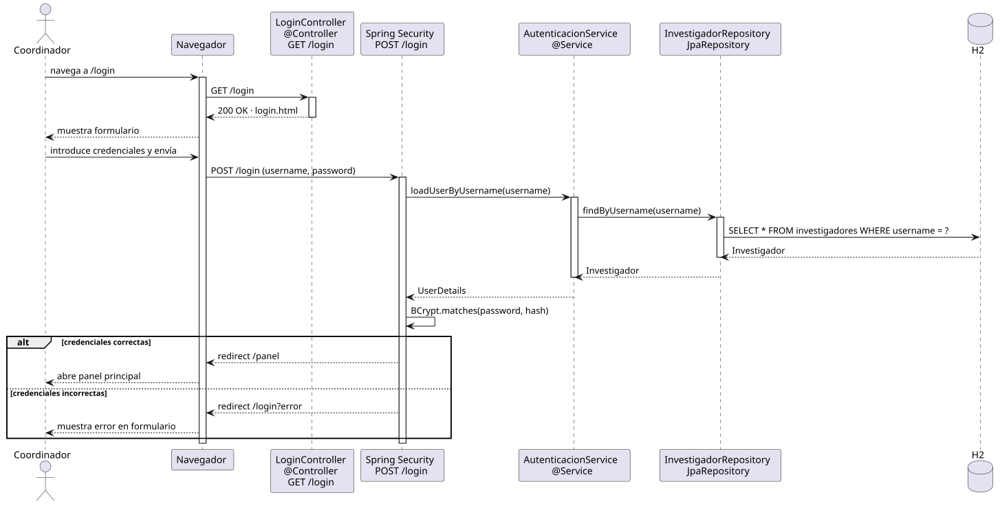

# iniciarSesion — Diseño

## Información del artefacto

- **Proyecto**: FUNIBER GIPF
- **Fase RUP**: Elaboración
- **Disciplina**: Diseño
- **Actor**: Coordinador
- **Caso de uso**: iniciarSesion()

## Propósito

Mostrar el formulario de acceso y autenticar al usuario mediante Spring Security, redirigiendo al panel principal si las credenciales son correctas.

## Diagrama de secuencia

[Código PlantUML](../../../modelosUML/diseño/coordinador/iniciarSesion.puml)

## Participantes

| Análisis | Spring Boot | Rol |
|---|---|---|
| IniciarSesionView | `LoginController` `@Controller` | Recibe GET /login y devuelve login.html |
| AutenticacionController | Spring Security `UsernamePasswordAuthenticationFilter` | Intercepta POST /login; orquesta la validación de credenciales |
| AutenticacionController | `AutenticacionService` `@Service` `UserDetailsService` | Carga el usuario por username para que Spring Security verifique la contraseña |
| InvestigadorRepository | `InvestigadorRepository` JpaRepository | Busca el investigador por username en H2 |
| Investigador | `Investigador` `@Entity` | Tabla investigadores en H2 |

## Rutas

| Método | URL | Acción |
|---|---|---|
| GET | /login | Muestra el formulario de inicio de sesión |
| POST | /login | Spring Security procesa las credenciales; redirige a /panel o /login?error |

## Decisiones de diseño

- `LoginController` solo gestiona el GET; Spring Security maneja el POST /login directamente mediante `formLogin`.
- `AutenticacionService` implementa `UserDetailsService`; Spring Security compara la contraseña con BCrypt internamente.
- Redireccionamiento exitoso a `/panel` configurado con `defaultSuccessUrl("/panel", true)` en `SecurityConfig`.
- Credenciales incorrectas redirigen a `/login?error` sin exponer motivo concreto.
