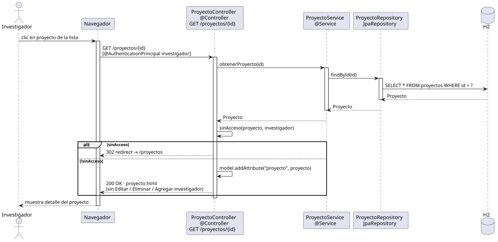

# abrirProyecto — Diseño (Investigador)

## Información del artefacto

- **Proyecto**: FUNIBER GIPF
- **Fase RUP**: Elaboración
- **Disciplina**: Diseño
- **Actor**: Investigador
- **Caso de uso**: abrirProyecto()

## Propósito

Mostrar el detalle de un proyecto al Investigador autenticado. El controller verifica que el investigador es miembro del proyecto antes de mostrarlo; si no lo es, redirige a la lista. El template oculta las acciones de gestión que solo corresponden al Coordinador.

## Diagrama de secuencia

[Código PlantUML](../../../modelosUML/diseño/investigador/abrirProyecto.puml)

## Participantes

| Análisis | Spring Boot | Rol |
|---|---|---|
| ProyectoView (azul) | `ProyectoController` `@Controller` | Recibe GET /proyectos/{id}; verifica membresía si el usuario es INVESTIGADOR |
| ProyectoController (amarillo) | `ProyectoService` `@Service` | Obtiene el proyecto por id |
| ProyectoRepository (naranja) | `ProyectoRepository` JpaRepository | Ejecuta SELECT por id |
| Proyecto (naranja) | `Proyecto` `@Entity` | Incluye la lista `investigadores` cargada por la relación ManyToMany |

## Rutas

| Método | URL | Acción |
|---|---|---|
| GET | /proyectos/{id} | Muestra el detalle del proyecto |

## Decisiones de diseño

- El controller recibe `@AuthenticationPrincipal Investigador` y comprueba `proyecto.getInvestigadores().contains(investigador)`.
- Si el investigador no es miembro → `redirect:/proyectos` (no puede ver ese proyecto).
- Si es miembro → muestra `proyecto.html` con el mismo modelo que el Coordinador.
- El template usa `sec:authorize="hasRole('COORDINADOR')"` para ocultar los enlaces Editar, Eliminar y Agregar investigador al Investigador.
- La lista de miembros del equipo se renderiza directamente desde `proyecto.investigadores` (lazy loading resuelto por Open Session in View de Spring Boot).
