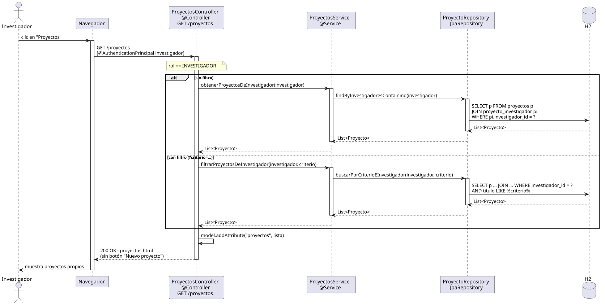

# abrirProyectos — Diseño (Investigador)

## Información del artefacto

- **Proyecto**: FUNIBER GIPF
- **Fase RUP**: Elaboración
- **Disciplina**: Diseño
- **Actor**: Investigador
- **Caso de uso**: abrirProyectos()

## Propósito

Recuperar y mostrar solo los proyectos en los que el Investigador autenticado participa como miembro. Mismo endpoint que el Coordinador (`GET /proyectos`); el controller decide el alcance de la consulta según el rol del usuario.

## Diagrama de secuencia

[Código PlantUML](../../../modelosUML/diseño/investigador/abrirProyectos.puml)

## Participantes

| Análisis | Spring Boot | Rol |
|---|---|---|
| ProyectosView (azul) | `ProyectosController` `@Controller` | Recibe GET /proyectos; obtiene el investigador del contexto de seguridad y ramifica por rol |
| ProyectosController (amarillo) | `ProyectosService` `@Service` | Ruta INVESTIGADOR: llama a `findByInvestigadoresContaining` o `buscarPorCriterioEInvestigador` |
| ProyectoRepository (naranja) | `ProyectoRepository` JpaRepository | Ejecuta la query filtrada por investigador |
| Proyecto (naranja) | `Proyecto` `@Entity` | Tabla proyectos; relación `@ManyToMany` con `Investigador` |
| Investigador (naranja) | `Investigador` `@Entity` | Se usa como parámetro de filtrado |

## Rutas

| Método | URL | Acción |
|---|---|---|
| GET | /proyectos | Lista proyectos (todos si coordinador, propios si investigador) |
| GET | /proyectos?criterio=texto | Lista filtrada (mismo alcance según rol) |

## Decisiones de diseño

- El controller recibe el usuario autenticado con `@AuthenticationPrincipal Investigador`.
- Si `rol == COORDINADOR` → comportamiento existente (`findAll` / `buscarPorCriterio`).
- Si `rol == INVESTIGADOR` → `findByInvestigadoresContaining(investigador)` / `buscarPorCriterioEInvestigador(investigador, criterio)`.
- La relación `@ManyToMany` entre `Proyecto` e `Investigador` usa una tabla join `proyecto_investigador` generada por Hibernate.
- El template oculta el botón "Nuevo proyecto" para investigadores con `sec:authorize="hasRole('COORDINADOR')"`.
